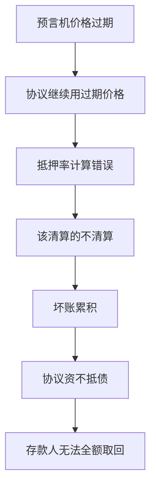

# 5.3 预言机失效模式与攻击场景

## 四种失效类型

### 1. 延迟（Latency）

价格更新不够快。在剧烈波动的市场中，如果预言机价格滞后 30 秒，协议使用的价格可能与实际市场价格偏差巨大。

场景：SUI 在 10 秒内从 2.0 跌到 1.5，但预言机还显示 2.0。此时：

- 借贷协议认为所有仓位仍然健康，不触发清算
- 实际上很多仓位已经资不抵债
- 坏账在不知不觉中累积

### 2. 过期（Stale Price）

预言机停止更新。可能的原因：

- 节点离线
- Gas 价格过高，推送不划算
- 数据源本身出了问题

```move
public fun is_price_fresh(feed: &PriceFeed, max_age_ms: u64): bool {
    let now = tx_context::timestamp_ms();
    let (_, _, ts) = price_feed::get_price(feed);
    now - ts <= max_age_ms
}
```

过期价格的危害：协议继续使用最后一次更新的价格。如果市场已经剧烈变化，协议就在"盲操作"。

### 3. 偏差（Deviation）

预言机价格与市场真实价格偏差过大。可能的原因：

- 数据源异常
- 聚合算法问题
- 极端行情下的数据稀疏

### 4. 操纵（Manipulation）

攻击者故意扭曲预言机价格。最常见的方式是**闪电贷攻击**：

```
1. 攻击者通过闪电贷借入大量 SUI
2. 在 DEX 上用 SUI 大量买入 USDC，扭曲 SUI/USDC 价格
3. 预言机读取被扭曲的 DEX 价格
4. 利用被扭曲的价格在借贷协议中操作（如低价清算他人仓位）
5. 在 DEX 上反向操作恢复价格
6. 偿还闪电贷，保留利润
```

## 攻击链："过期价格 + 继续执行"的级联效应

这是最危险的失效模式，因为它不是单一故障，而是一个链条：



关键点：**协议不应该在预言机价格过期时继续正常运行。** 正确的行为是暂停依赖价格的操作，直到价格恢复更新。

## 防御清单

| 失效类型 | 防御措施            | Move 实现要点                   |
| -------- | ------------------- | ------------------------------- |
| 延迟     | 使用多个预言源      | 多个 PriceFeed 对象，取中位数   |
| 过期     | 时间校验 + 自动暂停 | `assert!(now - ts <= max_age)`  |
| 偏差     | 与参考价格对比      | 偏差超过阈值则拒绝              |
| 操纵     | TWAP + 闪电贷检测   | 时间加权平均 + 单区块交易量限制 |

```move
public struct PriceGuard has store {
    last_price: u64,
    twap_accumulator: u128,
    last_update_time: u64,
    max_single_update_bps: u64,
}

public fun validate_price_update(
    guard: &mut PriceGuard,
    new_price: u64,
    timestamp: u64,
): bool {
    if (guard.last_price == 0) {
        guard.last_price = new_price;
        guard.last_update_time = timestamp;
        return true
    };
    let deviation = if (new_price > guard.last_price) {
        (new_price - guard.last_price) * 10000 / guard.last_price
    } else {
        (guard.last_price - new_price) * 10000 / guard.last_price
    };
    deviation <= guard.max_single_update_bps
}
```
