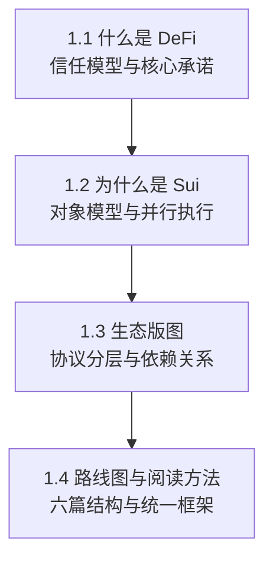

# 第 1 章 DeFi 全景与 Sui 的定位

本章是全书的地形图。在逐个拆解 DeFi 协议之前，我们需要先看清三件事：DeFi 本质上在解决什么问题，Sui 的技术特征为什么对 DeFi 有意义，当前 Sui 上的 DeFi 生态由哪些关键协议和基础设施构成。

本章四节的关系如下：

**1.1 节** 建立 DeFi 的基本认知框架：中心化与去中心化信任模型的根本差异，DeFi 的三层承诺和三重风险。如果你已经有 DeFi 基础，可以快速浏览。

**1.2 节** 回答"为什么是 Sui"。重点不是"哪条链更好"，而是对象模型对 DeFi 协议设计的具体影响。如果你有 EVM 背景，这一节尤其值得关注。

**1.3 节** 绘制 Sui DeFi 的生态版图。按功能层划分协议，展示它们之间的依赖关系。这不是项目索引，而是帮助你理解基础设施的堆叠顺序。

**1.4 节** 给出全书的阅读路线和每章的统一分析方法。

> 风险提示：本章对 DeFi 的描述偏理想化。真实的 DeFi 协议往往在"去中心化"的光谱上处于中间位置——号称去中心化的协议可能有中心化的价格源、可升级的合约和少数人控制的治理。本书后续章节会持续回到这个张力上。

## 本章目标

- 建立 DeFi 的信任模型、资产流与风险语言。
- 理解 Sui 对象模型、并行执行与 DeFi 协议设计之间的关系。
- 看清 Sui DeFi 生态的基础设施层级，而不是只记项目名称。
- 掌握本书后续章节反复使用的阅读路线。

## 先修知识

- 了解钱包、交易、链上资产和智能合约的基本概念。
- 不要求有 Sui 或 Move 经验，本章会给出后续学习的最低背景。

## 本章小结

本章把全书放到一张地图上：DeFi 不是单个产品，而是一组围绕资产托管、交易、信用、收益与风险转移的协议网络；Sui 的对象模型让这些协议在资产所有权和组合方式上有不同于账户模型链的设计空间。

## 练习题

1. 把一个中心化交易所的充值、撮合、提现流程改写成链上 DEX 的资产流。
2. 说明 owned object 和 shared object 分别适合承载哪类 DeFi 状态。
3. 任选一个 Sui DeFi 协议，按基础设施层、协议层、应用层归类。
4. 列出一个“透明”机制同时带来的一个好处和一个风险。

## 下一章连接

下一章进入 Sui 对象模型与 Move 语言精要，开始把本章的抽象概念落到代码结构。
