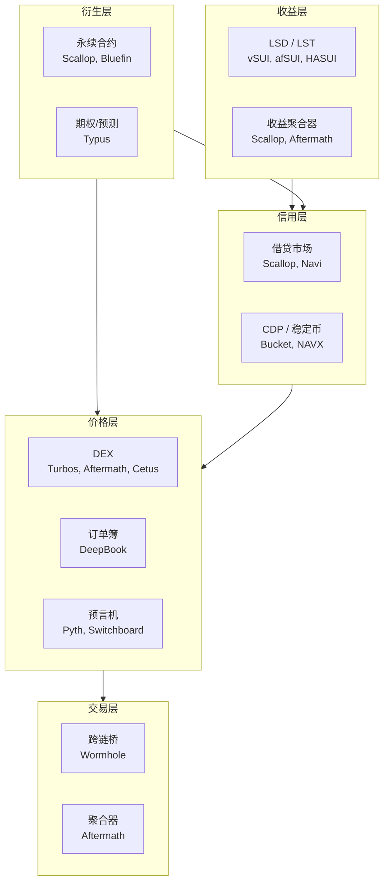

## 1.3 Sui DeFi 生态版图与依赖关系

### 功能分层

Sui 上的 DeFi 协议可以按功能分为五个层次。每层依赖下层提供的基础设施，为上层提供可组合的构建模块。

### 各层核心协议

**交易层**：用户进入 DeFi 的入口。跨链桥将资产从其他链引入 Sui，聚合器寻找最优交易路径。

**价格层**：DeFi 的基础设施。DEX 提供链上流动性，预言机提供外部价格数据。几乎所有上层协议都依赖这一层。

| 协议 | 类型 | 特点 |
|------|------|------|
| Turbos Finance | CL-AMM | 集中流动性，资金效率高 |
| Cetus | CL-AMM | 集中流动性，支持跨链 |
| Aftermath Finance | 聚合 AMM | 路由优化，多池聚合 |
| DeepBook | 订单簿 | 原生订单簿引擎 |
| Pyth Network | 预言机 | 推送式价格，高频更新 |
| Switchboard | 预言机 | 拉取式价格，多源聚合 |

**信用层**：DeFi 的核心创新。借贷市场匹配资金供需，CDM 协议通过抵押铸造稳定币。两者都依赖价格层提供的价格数据。

| 协议 | 类型 | 特点 |
|------|------|------|
| Scallop | 借贷 | 混合模型，利率动态调整 |
| Navi Protocol | 借贷 | 隔离池设计 |
| Bucket Protocol | CDP | SUI 抵押铸造 BUCK |
| NAVX | CDP | 多资产抵押 |

**收益层**：在底层资产收益之上叠加收益策略。LSD 将质押的 SUI 转化为可交易的 LST（Liquid Staking Token），收益聚合器将资金分配到多个策略中。

**衍生层**：提供杠杆和方向性敞口。永续合约是最主要的衍生品类型，在 Sui 上的实现通常采用虚拟 AMM 或订单簿模型。

### 依赖关系与系统性风险

上图展示的层级关系也是风险传导路径。2024 年的一次典型风险链如下：

1. 预言机（Pyth）价格延迟 → 2. 借贷协议（Scallop）清算不及时 → 3. 坏账积累导致存款人无法取款 → 4. 收益聚合器（Aftermath）中暴露于 Scallop 的策略受损

这意味着：评估一个协议的风险，不能只看该协议本身，必须追溯它的整个依赖链。本书的"五问法"中，"价格从哪来"和"失败会怎样"两个问题专门用于暴露这种依赖。

> 风险提示：生态版图中的依赖关系图会随时间变化。本书出版时描述的具体协议状态可能已过时。但层级结构和依赖模式是相对稳定的——无论具体协议如何更替，"信用层依赖价格层"这个关系不会改变。
