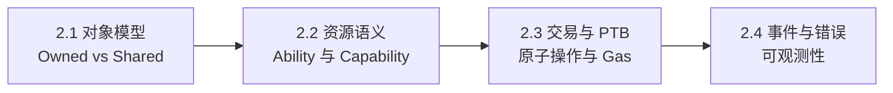

# 第 2 章 Sui 对象模型与 Move 语言精要

本章是全书中技术密度最高的一章。我们的目标不是教你会写 Move——那是 Sui 官方文档的任务——而是建立一套**安全视角的语言理解**：哪些语言特性构成了 DeFi 协议的安全边界，哪些特性在特定场景下可能成为陷阱。

如果你已经有 Move 开发经验，本章仍然值得细读，因为我们会重点讨论 ability 系统和对象模型在 DeFi 语境下的安全含义——这些在语言教程中通常不会深入。

本章四节的关系：

阅读建议：2.1 和 2.2 是后续所有章节的前置知识，必读。2.3 和 2.4 可以在阅读第二篇协议分析时回头查阅。

> 风险提示：本章会频繁使用"安全边界"这个概念。安全边界不是"代码没有 bug"，而是"即使代码有 bug，损失的范围也被语言或系统约束所限制"。Move 的类型系统提供了比 Solidity 更强的安全边界，但它不能替代机制层面的安全设计。

## 本章目标

- 理解 owned object、shared object、UID 与能力系统的关系。
- 掌握 Move 资源语义如何表达资产不可复制、不可丢弃。
- 理解 PTB 如何把多个协议调用组合成一笔原子交易。
- 会用事件和错误码为后续 DeFi 模块提供可观测性。

## 先修知识

- 读过第 1 章，理解 DeFi 协议为什么需要严格的资产边界。
- 有任意编程语言经验，能阅读结构体、函数与测试。

## 本章小结

本章给后续所有协议实现打底。读者不需要一次学完整个 Move 语言，但必须建立“对象即状态、能力即权限、资源即资产”的直觉。

## 练习题

1. 解释为什么 `Coin<T>` 不能被复制，以及这对资金安全意味着什么。
2. 设计一个只允许管理员修改参数的 Capability 对象。
3. 画出一笔包含 swap 和 lending deposit 的 PTB 调用顺序。
4. 为一个存款函数设计最少两个事件字段。

## 下一章连接

下一章把语言能力抽象成 DeFi 的四个核心对象：池、仓位、价格和收益。
