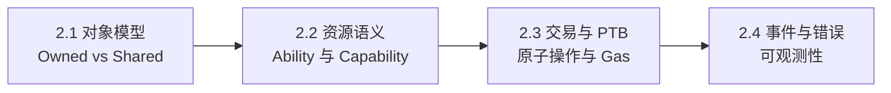

# 第 2 章 Sui 对象模型与 Move 语言精要

本章是全书中技术密度最高的一章。我们的目标不是教你会写 Move——那是 Sui 官方文档的任务——而是建立一套**安全视角的语言理解**：哪些语言特性构成了 DeFi 协议的安全边界，哪些特性在特定场景下可能成为陷阱。

如果你已经有 Move 开发经验，本章仍然值得细读，因为我们会重点讨论 ability 系统和对象模型在 DeFi 语境下的安全含义——这些在语言教程中通常不会深入。

本章四节的关系：

阅读建议：2.1 和 2.2 是后续所有章节的前置知识，必读。2.3 和 2.4 可以在阅读第二篇协议分析时回头查阅。

> 风险提示：本章会频繁使用"安全边界"这个概念。安全边界不是"代码没有 bug"，而是"即使代码有 bug，损失的范围也被语言或系统约束所限制"。Move 的类型系统提供了比 Solidity 更强的安全边界，但它不能替代机制层面的安全设计。
