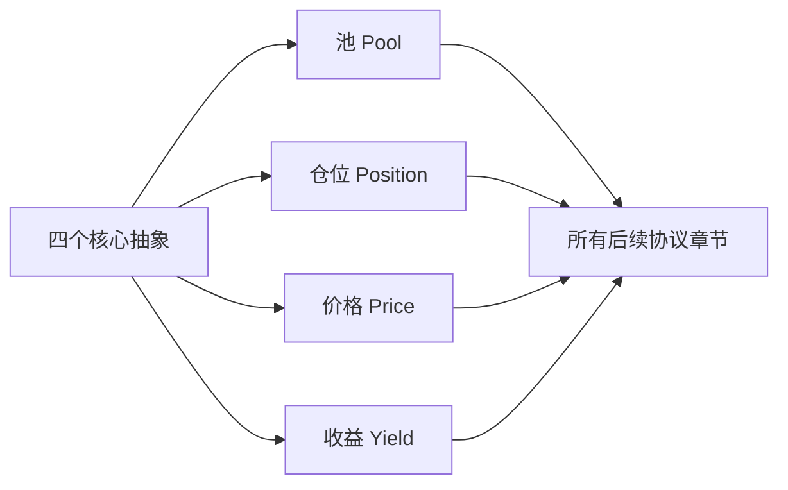

# 第 3 章 DeFi 核心抽象与风险语言

## 为什么需要这一章

从第 4 章开始，本书会逐个分析具体的 DeFi 协议——DEX、预言机、借贷、CDP、LSD、衍生品、Launchpad。这些协议表面上千差万别，但底层都由四个基本抽象组成：

```
池（Pool）—— 资金聚集的容器
仓位（Position）—— 用户在池中的权益凭证
价格（Price）—— 协议运行的输入信号
收益（Yield）—— 用户参与协议的回报
```

理解这四个抽象，就像学会了乐理再去听音乐——你不再只是"感受"，而是能"拆解"。

本章还会建立两个工具：

- **收益拆解框架**——帮你区分真实收益和虚假宣传
- **五问法**——帮你用统一框架分析任何新协议



## 本章结构

| 小节 | 内容         | 核心产出                    |
| ---- | ------------ | --------------------------- |
| 3.1  | 四个核心抽象 | 每个抽象的 Move struct 模板 |
| 3.2  | 收益拆解     | APR/APY 计算函数            |
| 3.3  | 风险分类体系 | 风险分类表                  |
| 3.4  | 五问法       | 用五问法分析 AMM 的完整示例 |
