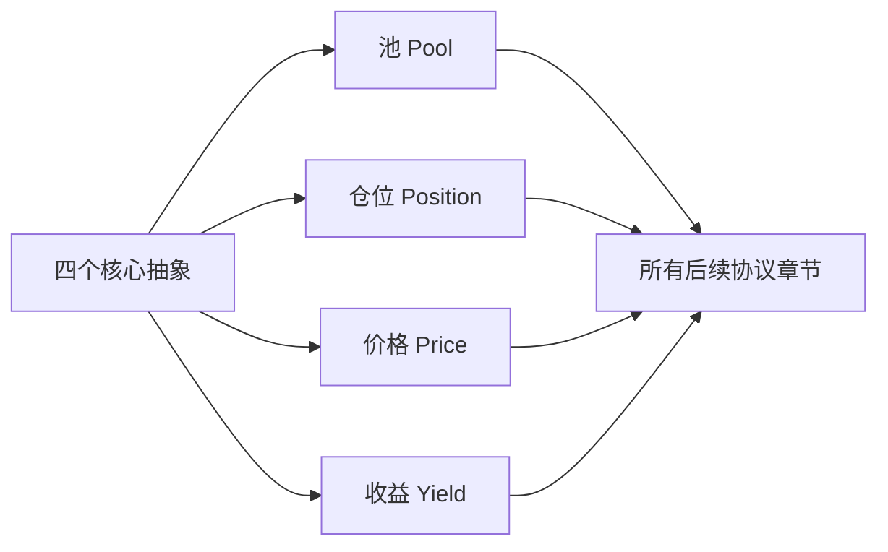

# 第 3 章 DeFi 核心抽象与风险语言

## 为什么需要这一章

从第 4 章开始，本书会逐个分析具体的 DeFi 协议——DEX、预言机、借贷、CDP、LSD、衍生品、Launchpad。这些协议表面上千差万别，但底层都由四个基本抽象组成：

```
池（Pool）—— 资金聚集的容器
仓位（Position）—— 用户在池中的权益凭证
价格（Price）—— 协议运行的输入信号
收益（Yield）—— 用户参与协议的回报
```

理解这四个抽象，就像学会了乐理再去听音乐——你不再只是"感受"，而是能"拆解"。

本章还会建立两个工具：

- **收益拆解框架**——帮你区分真实收益和虚假宣传
- **五问法**——帮你用统一框架分析任何新协议



## 本章结构

| 小节 | 内容         | 核心产出                    |
| ---- | ------------ | --------------------------- |
| 3.1  | 四个核心抽象 | 每个抽象的 Move struct 模板 |
| 3.2  | 收益拆解     | APR/APY 计算函数            |
| 3.3  | 风险分类体系 | 风险分类表                  |
| 3.4  | 五问法       | 用五问法分析 AMM 的完整示例 |


## 本章目标

- 建立池、仓位、价格、收益四个核心抽象。
- 区分 APR、APY、真实收益与补贴收益。
- 把代码风险、经济风险、治理风险放进同一个风险分类体系。
- 掌握后续每章使用的五问法。

## 先修知识

- 理解 Move 对象和资产能力的基本含义。
- 能接受用简单公式描述收益、价格和风险。

## 本章小结

本章是全书的方法论层。只要能持续追问“资产怎么流、价格从哪来、收益由谁支付、风险由谁承担、权限由谁控制”，后面的复杂协议就不会变成术语堆叠。

## 练习题

1. 把一个 AMM 池拆成池、仓位、价格、收益四个对象。
2. 说明补贴 APR 和交易手续费 APR 的风险差异。
3. 任选一个借贷协议，按五问法列出核心问题。
4. 给“预言机错误导致清算失败”归类到风险分类表。

## 下一章连接

下一篇进入价格基础设施，先从 DEX 这个最基础的链上价格生产机制开始。
