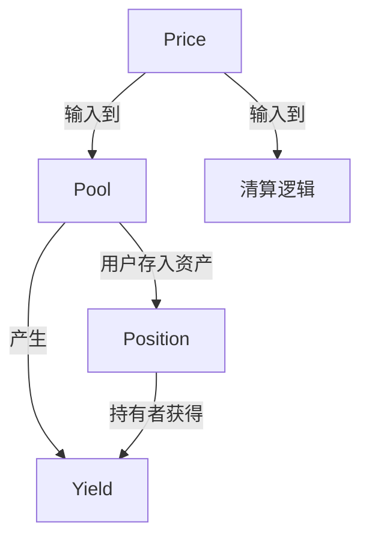

# 3.1 四个核心抽象：池、仓位、价格、收益

无论一个 DeFi 协议多么复杂，底层都由四个抽象组合而成。理解它们，你就拥有了拆解任何协议的通用语言。

## 池（Pool）

池是资金聚集的容器。用户把资产放进池子里，协议按照预设的规则使用这些资产。

在 Sui 上，池通常是一个 **Shared Object**——因为任何人都可以向它存入或从中取出，它不能被某个地址独占。

```move
struct Pool<phantom T> has key {
    id: UID,
    balance: Balance<T>,
    total_shares: u64,
    fee_bps: u64,
    paused: bool,
}
```

关键设计点：
- `balance` 用 `Balance<T>` 而不是 `u64`，确保类型安全
- `total_shares` 记录所有 LP 持有的份额总和
- `paused` 是紧急暂停开关
- 用 `phantom T` 让同一个模块可以实例化不同代币的池子

## 仓位（Position）

仓位是用户在池中的权益凭证。它是"我存了多少"的链上证明。

在 Sui 上，仓位通常是一个 **Owned Object**——它只属于某个地址，只有持有者能操作它。

```move
struct Position<phantom T> has key, store {
    id: UID,
    pool_id: ID,
    shares: u64,
    deposited_at: u64,
}
```

关键设计点：
- `pool_id` 关联到对应的池子
- `shares` 代表持有份额（不是代币数量）
- `store` ability 允许这个对象被转移或嵌入其他对象
- 没有 `drop` ability——仓位不能被意外销毁，必须通过显式的 withdraw 操作处理

## 价格（Price）

价格是协议运行的输入信号。它决定了：
- 借贷协议中抵押品价值多少
- 清算是否应该触发
- AMM 中 swap 的执行价格

价格本身不是对象，它通常从两个来源获取：

```move
struct PriceInfo has copy, drop, store {
    price: u64,
    confidence: u64,
    timestamp: u64,
    source_id: ID,
}
```

来源一：DEX 的交易价格（池内比例推导）
来源二：预言机（Pyth、Switchboard 等）

价格的核心问题不是"准不准"，而是"在极端条件下还能不能信任"。

## 收益（Yield）

收益是用户参与协议的回报。它分为三类：

| 类型 | 来源 | 可持续性 | 例子 |
|------|------|----------|------|
| 手续费收益 | 真实交易行为 | 高 | DEX swap 手续费 |
| 激励收益 | 代币排放 | 中 | 流动性挖矿奖励 |
| 补贴收益 | 项目方预算 | 低 | "前30天双倍收益" |

```move
struct YieldAccumulator has store {
    accumulated_fee: u64,
    accumulated_incentive: u64,
    accumulated_subsidy: u64,
    last_update_epoch: u64,
}
```

用户看到的"总 APY"通常是三者的加总。但只有手续费收益反映协议的真实价值创造。

## 四个抽象的关系



- 用户持有 Position，从 Pool 中获得 Yield
- Price 是外部输入，影响 Pool 的行为（如清算）
- Position 的价值由 Price 和 Yield 共同决定

## Sui 上的对象模式总结

| 抽象 | 对象类型 | ability | 原因 |
|------|----------|---------|------|
| Pool | Shared Object | `key` | 任何人都能交互 |
| Position | Owned Object | `key, store` | 只有持有者能操作 |
| Price | 非对象（数据结构） | `copy, drop, store` | 临时数据，用完即弃 |
| Yield | 嵌入 Position | `store` | 随 Position 一起存在 |
