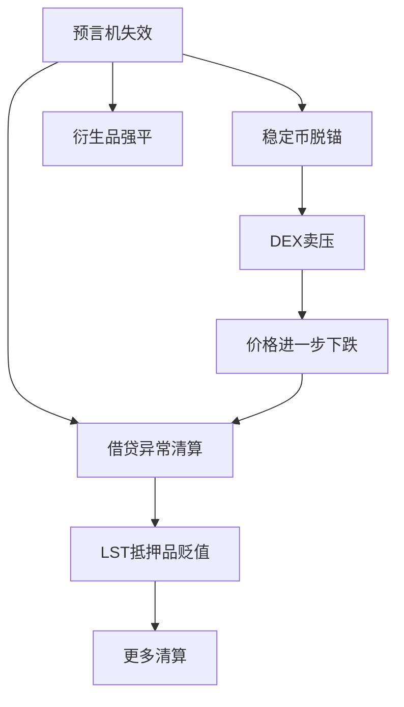

# 3.3 风险分类体系

## 四类核心风险

| 风险类型 | 定义 | 触发条件 | 典型后果 |
|----------|------|----------|----------|
| 流动性风险 | 无法以合理价格完成交易 | 池子资金不足、大量赎回 | 高滑点、交易失败 |
| 价格风险 | 资产价值偏离预期 | 行情波动、预言机异常 | 抵押不足、意外清算 |
| 清算风险 | 清算机制未能按预期工作 | 清算者缺席、Gas飙升、抵押品无流动性 | 坏账累积、协议资不抵债 |
| 系统性风险 | 多个协议同时失效 | 极端行情、关联抵押品暴跌 | 级联清算、信任崩溃 |

## 协议内风险 vs 协议间风险

**协议内风险**：单个协议自身设计缺陷导致的问题。

- 利率模型参数不当导致资金利用率异常
- 清算阈值设置过紧，正常波动也触发清算
- 暂停机制缺失，极端情况下无法止损

**协议间风险**：由协议间依赖关系引发的问题。

- 借贷协议依赖 DEX 价格，DEX 被操纵导致借贷异常
- LSD 代币作为抵押品，质押协议出问题导致借贷连锁清算
- 多个协议共用同一个预言机，预言机失效导致全面崩溃



上图展示了系统性风险的典型传播路径：预言机失效 → 多个协议同时异常 → 抵押品贬值 → 更多清算 → 价格进一步下跌 → 恶性循环。

## 风险的量化视角

在 Move 代码中，风险参数通常表现为配置对象：

```move
public struct RiskConfig has store {
    liquidation_threshold_bps: u64,
    liquidation_penalty_bps: u64,
    max_ltv_bps: u64,
    reserve_factor_bps: u64,
    price_deviation_limit_bps: u64,
    min_oracle_update_interval_ms: u64,
}
```

每个参数都定义了一道防线。参数之间的关系比单个参数的值更重要：

- `max_ltv_bps` 必须 < `liquidation_threshold_bps`，否则用户一借款就被清算
- `price_deviation_limit_bps` 控制预言机跳变容忍度，设太大会放过真实价格变化，设太小会导致正常更新被拒绝
- `reserve_factor_bps` 是协议的自保储备金比例

## 按影响范围的风险分级

| 级别 | 影响范围 | 例子 | 应对策略 |
|------|----------|------|----------|
| L1 单用户 | 一个用户的仓位 | 个人清算 | 仓位级监控 |
| L2 单协议 | 一个协议的所有用户 | 利率模型失灵 | 协议级参数调整 |
| L3 跨协议 | 依赖链上的多个协议 | 预言机操纵 | 多源验证、熔断 |
| L4 系统性 | 整个生态 | LST 大规模折价 | 紧急暂停、保险基金 |
