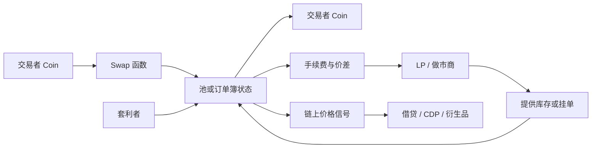

# 第 4 章 DEX：从链上交易到全类型交易所

DEX（Decentralized Exchange）是 DeFi 的入口协议。不是因为它最复杂，而是因为它做的事情最基础——**产生价格**。后续所有协议都依赖 DEX 产生的价格：借贷用价格算抵押率，CDP 用价格维持锚定，衍生品用价格算保证金。

## 本章为什么需要 30 节

传统 DEX 教材往往只讲 AMM。但 Sui 生态的 DEX 格局已经非常多元：Cetus 用 CLMM、Turbos 用 CLMM、DeepBook 用 Orderbook、FlowX 用 Hybrid、Kriya 用 AMM+Perps。只理解 AMM 无法理解这些协议的差异和选择。

本章从最简单的固定汇率开始，逐步构建到完整的交易系统：

```
Part 0 — 交易基础（4.1-4.4）
  什么是链上交易 → Sui 的独特优势 → 生态概览 → 核心模块

Part 1 — 第一个 Swap（4.5-4.7）
  固定汇率 → 最小流动性池 → 费用机制

Part 2 — CPMM AMM（4.8-4.11）
  数学推导 → 滑点分析 → 套利机制 → 完整实现

Part 3 — AMM 经济模型（4.12-4.14）
  无常损失 → LP 收益 → 多池设计

Part 4 — CLMM 集中流动性（4.15-4.19）
  为什么需要 → Tick 机制 → Position NFT → Swap 算法 → 完整实现

Part 5 — DLMM（4.20-4.22）
  概念 → Bin 模型 → 实现

Part 6 — StableSwap（4.23-4.24）
  曲线数学 → 实现

Part 7 — Orderbook（4.25-4.27）
  为什么需要 → 撮合引擎 → 实现

Part 8 — 高级设计（4.28-4.30）
  Hybrid DEX → 多池路由 → 架构选择框架
```

## 学习路径建议

- **快速入门**：读 Part 0 + Part 1，理解基本概念
- **AMM 掌握**：Part 2 + Part 3，理解最常用的 DEX 模型
- **全面理解**：Part 4-7，掌握所有主流 DEX 类型
- **架构设计**：Part 8，学会选择合适的 DEX 架构

## 资产流与模型选择



选择模型时先看资产特征：长尾资产通常需要简单 AMM 冷启动；主流波动资产适合 CLMM 提升资金效率；强相关资产适合 StableSwap 降低滑点；专业交易对需要订单簿或混合架构承载限价单和做市策略。


## 本章目标

- 从固定汇率池一路理解 AMM、CLMM、DLMM、StableSwap、订单簿与混合 DEX。
- 掌握 swap、LP、手续费、滑点、价格冲击和套利回归的共同数学。
- 理解 Sui 对 DEX 对象设计、并发访问和 PTB 组合的影响。
- 能根据资产特征选择合适的 DEX 架构。

## 先修知识

- 熟悉第 3 章的池、仓位、价格、收益抽象。
- 能阅读基础 Move 结构体和 u64/u128 数学代码。

## 本章小结

DEX 是价格基础设施，不只是交易界面。本章的关键不是背下每一种曲线，而是理解不同曲线和撮合模型如何在价格发现、资金效率、做市门槛和攻击面之间取舍。

## 练习题

1. 解释为什么恒定乘积池会在大额交易时产生价格冲击。
2. 比较 CLMM Position 和普通 LP 份额的对象设计差异。
3. 说明 StableSwap 为什么适合相关资产而不适合所有资产。
4. 为一个长尾资产池选择 AMM、CLMM 或订单簿，并说明原因。

## 下一章连接

DEX 产生价格，但很多 DeFi 协议还需要链外价格事实；下一章进入预言机。
