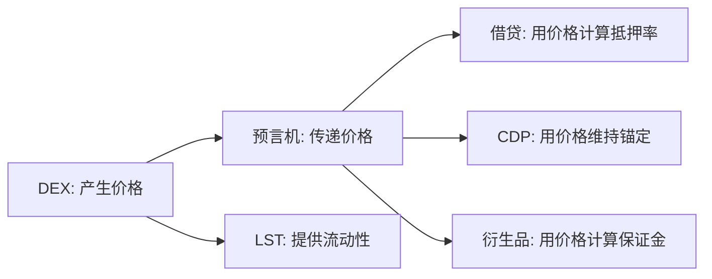

# 第 4 章 DEX：从固定汇率到链上订单簿

## 为什么从交易开始

DEX（Decentralized Exchange）是 DeFi 的入口协议。不是因为它最复杂，而是因为它最基础——它做的事情是所有后续协议都依赖的：**产生价格**。



## 本章的递进逻辑

我们不直接讲最复杂的 DEX。而是从一个最简单的固定汇率兑换开始，逐步增加复杂度，最终到链上订单簿。每一步都在解决上一步的问题：

```
固定汇率 → "只能 1:1 换，不灵活"
    ↓
AMM → "灵活了，但滑点大、资金效率低"
    ↓
Uniswap V2 → "AMM 的经典实现，完整代码"
    ↓
Uniswap V3 → "资金效率提升，但需要主动管理"
    ↓
DLMM → "动态调整区间，更智能的集中流动性"
    ↓
StableSwap → "稳定币对的特殊优化曲线"
    ↓
Orderbook → "最精确的价格发现，但实现最复杂"
```

| 小节 | DEX 类型 | 价格机制 | 难度 |
|------|----------|----------|------|
| 4.1 | — | 为什么需要 DEX | 入口 |
| 4.2 | 固定汇率 | 硬编码比率 | 最简单 |
| 4.3 | AMM 理论 | x·y=k 数学推导 | 概念 |
| 4.4 | Uniswap V2 | 恒定乘积完整实现 | 中等 |
| 4.5 | Uniswap V3 | Tick + 集中流动性 | 较高 |
| 4.6 | DLMM | 动态流动性区间 | 高 |
| 4.7 | StableSwap | StableSwap 曲线 | 中等 |
| 4.8 | Orderbook | DeepBook 限价单撮合 | 高 |
| 4.9 | — | 全类型对比与选择框架 | 总结 |
