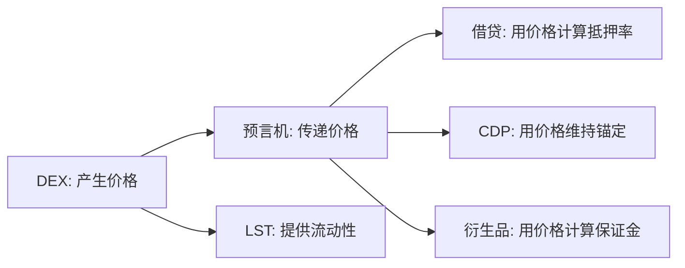

# 第 4 章 DEX：去中心化交易

## 为什么从交易开始

DEX（Decentralized Exchange）是 DeFi 的入口协议。不是因为它最复杂，而是因为它最基础——它做的事情是所有后续协议都依赖的：**产生价格**。

如果你不理解价格是怎么产生的，你就无法理解借贷、稳定币和衍生品在极端条件下会发生什么。

## 本章覆盖三种价格机制

| 机制 | 代表 | 价格精度 | 适用场景 |
|------|------|----------|----------|
| AMM（恒定乘积） | Uniswap V2 风格 | 低（依赖池深度） | 长尾资产、简单场景 |
| 集中流动性 | Cetus (Sui) | 中（区间内精度高） | 主流交易对、资金效率要求高 |
| 订单簿（CLOB） | DeepBook (Sui) | 高（限价单驱动） | 大额交易、价格敏感场景 |

每种机制在 Sui 上的实现方式不同，因为对象模型对状态管理有直接影响。
