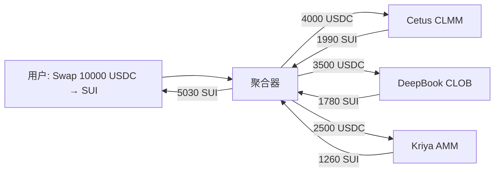

# 第 6 章 DEX 聚合器：最优路径与拆单执行

## 为什么需要聚合器

当 Sui 上有多个 DEX（Cetus、Kriya、DeepBook、Turbos 等），同一个交易对在不同 DEX 上的价格可能不同。用户手动比较价格再拆单交易既低效又容易出错。

聚合器（Aggregator）解决这个问题：**接收用户的一笔交易请求，自动在多个 DEX 之间拆单，找到最优执行路径。**

## 本章以 Cetus 和 DeepBook 为核心

Cetus 是 Sui 上最大的 CLMM DEX，DeepBook 是 Sui 上的链上订单簿。两者代表了 Sui 上两种最主流的流动性模型，也是聚合器最常路由的两个目的地。

| 小节 | 内容 |
|------|------|
| 6.1 | 聚合器的业务逻辑与架构 |
| 6.2 | Cetus CLMM 的路由集成 |
| 6.3 | DeepBook CLOB 的路由集成 |
| 6.4 | 路径搜索与拆单算法 |
| 6.5 | Sui 聚合器实例分析 |
