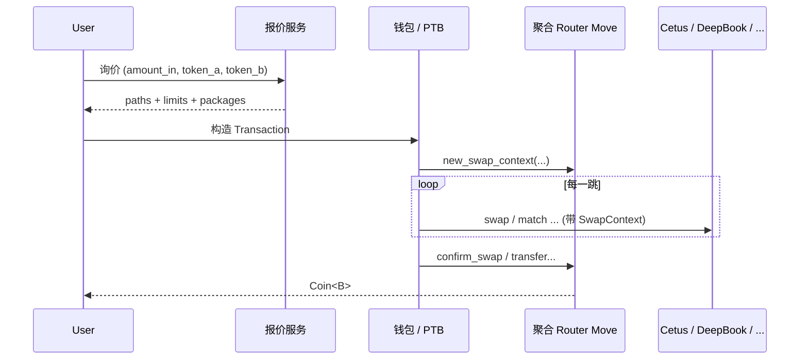

# 6.2 三层架构：报价 · 路由 · 结算

## 分层视图

成熟聚合器在工程上通常可拆为三层（与具体团队实现细节无关，Cetus 开源结构也符合这一分工）：

### Layer 1 — 链下报价层（Off-chain）

- 从链上或索引服务读取 **池状态、订单簿档位、手续费参数**；
- 在业务规则允许的网络内做 **路径搜索**（单跳、多跳、拆单）；
- 产出 **可执行的路由描述**：每一跳的 `provider`、池/市场 ID、方向、数量级、`published_at`（目标 Move 包）等。

这一层 **不算共识**：同一时刻两次报价可能不同；用户应以 **即将签名的那笔交易** 中的约束为准。

### Layer 2 — 链上路由层（On-chain Router）

- 由 **聚合器自有 Move 包** 提供入口（开源 TS 里常对应 `router::new_swap_context` 一类函数）；
- 构造 **`SwapContext` 对象**：绑定输入币对象、期望输出、最小输出、费率与收款地址等；
- 在 PTB 中 **依次调用** 各 DEX 暴露给聚合器的 **包装入口**（例如 Cetus 的 `cetus::swap`），并把上下文对象传入，使 **资金与约束** 在同一执行环境中传递。

### Layer 3 — 各 DEX 结算层

- 每个 DEX 仍按 **自己的不变量与状态机** 完成 swap；
- 聚合器不替代 CLMM 数学或订单簿撮合逻辑，只负责 **编排调用顺序** 与 **统一上下文**。



## 一笔用户视角的 PTB「节目单」（概念）

下面用 **伪代码** 表示单条聚合 swap 在 PTB 里常见的 **指令顺序**（真实函数名以链上模块为准）：

```text
1. router::new_swap_context_v2( quote_id, max_in, expect_out, min_out, coin_in, fee, recipient )
2. 对路径中每一跳 path_i：
     provider_i::swap( swap_context, ... 池/市场专用参数 ... , clock )
3. router::confirm_swap( swap_context )  --> Coin<Out>
4. （可选）pay::transfer 或 pay::transfer_or_destroy_coin 处理 dust
```

注意：**第 2 步的函数 target 每跳不同**——`{path_i.published_at}::cetus::swap`、`::deepbookv3::swap_a2b` 等；**第 1、3 步的 target** 则来自 **聚合器包**（API 返回的 `packages["aggregator_v3"]` 一类 key）。

## 与本书第 4 章的关系

第 4 章讲的是 **单个池子** 的曲线与实现；本章讲的是 **把多个池/簿串成一条可执行计划**。数学上仍可把每一跳看成函数复合，但 **工程难点在编排与安全性**，不在再推一遍 CLMM 公式。

下一节深入 **链上 Router 与 SwapContext**：先贴 **真实 TS `moveCall`**，再给 **本书可编译的 Move 教学模块**。
