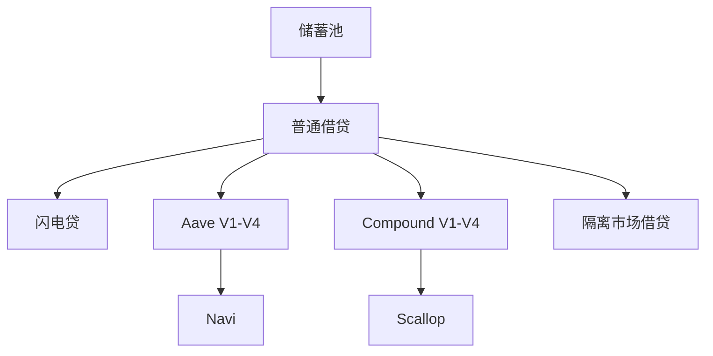

# 第 7 章 借贷：从储蓄池到多协议演进

## 借贷是 DeFi 第一个真正复杂的协议

DEX 解决的是"交换"，预言机解决的是"价格"。借贷解决的是"信用"——如何在不信任对方的情况下借出和借入资金。

借贷协议的复杂度来自它需要同时处理：
- **利率**（动态、随供需变化）
- **抵押品**（价值波动、需要清算）
- **预言机**（价格输入、失效保护）
- **流动性**（存款人随时想取、借款人随时想借）

## 本章的演进逻辑

| 小节 | 类型 | 核心内容 |
|------|------|----------|
| 7.1 | 储蓄池与普通借贷 | Move 完整实现 |
| 7.2 | 利率模型演进 | 从固定到动态的数学与代码 |
| 7.3 | 闪电贷 | 无抵押瞬时借贷 |
| 7.4 | Aave V1→V4 | 逐代创新分析 |
| 7.5 | Compound V1→V4 | 逐代创新分析 |
| 7.6 | Navi | Sui 原生借贷 |
| 7.7 | Scallop | Sui 原生借贷 |
| 7.8 | 隔离市场借贷 | Euler/Silo 风格 |
| 7.9 | 借贷全景对比 | 所有类型对比表 |
