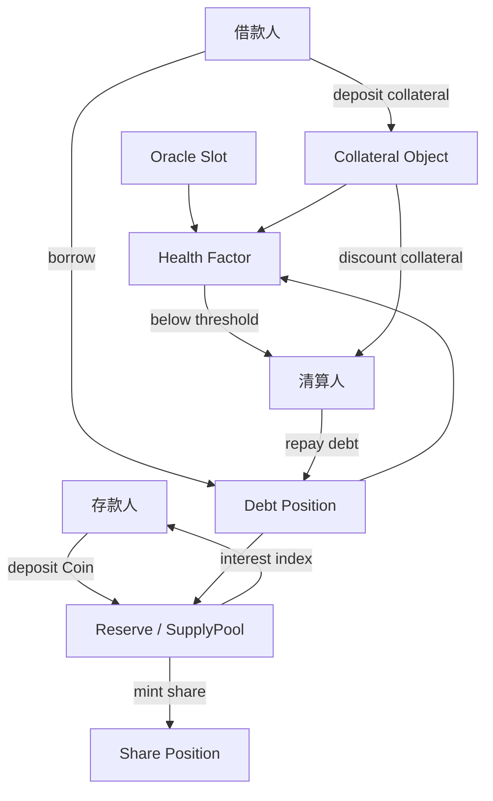

# 第 7 章 借贷：从储蓄池到完整借贷协议

借贷是 DeFi 的核心原语之一。如果说 DEX 解决了"交换"的问题，预言机解决了"定价"的问题，那么借贷协议解决的是"时间价值"的问题——让闲置资产产生收益，让急需资金的人获得流动性。

## 本章学习路径

本章共 30 节，分为 9 个部分，从零开始构建一个完整的借贷协议：

```
Part 0 — 设计基础（7.1-7.4）
  借贷的核心问题、模块分层、Sui 特有优势、整体架构

Part 1 — Supply Pool（7.5-7.7）
  存款凭证设计、Supply Pool 实现、利息累积指数

Part 2 — 借款系统（7.8-7.10）
  Debt Token 设计、Borrow/Repay 实现、借款利息累积

Part 3 — 抵押系统（7.11-7.13）
  Collateral Object、LTV 与 Health Factor、抵押管理实现

Part 4 — 利率模型（7.14-7.17）
  利用率、线性模型、Jump Rate Model、动态利率实现

Part 5 — 清算系统（7.18-7.21）
  清算触发、奖励罚金、部分清算、Liquidation Engine 实现

Part 6 — 闪电贷（7.22-7.24）
  Flash Loan 原理、原子安全模型、Move 实现

Part 7 — 高级架构（7.25-7.27）
  Cross Collateral、Isolated Market、架构对比实现

Part 8 — 风险与组装（7.28-7.30）
  预言机接口、参数设计方法、完整协议组装
```

## 配套代码

本章包含 3 个可运行的 Move 代码包：

| 代码包         | 路径                   | 说明                                                                |
| -------------- | ---------------------- | ------------------------------------------------------------------- |
| sui_savings    | `code/sui_savings/`    | 储蓄池（Share Token、deposit/withdraw、interest）                   |
| lending_market | `code/lending_market/` | 完整借贷市场（collateral、borrow、repay、liquidation、kinked rate） |
| flash_loan     | `code/flash_loan/`     | 闪电贷（hot potato 模式）                                           |

所有代码包均可独立编译和测试，章节内容会逐步引用这些实现。

## 借贷对象与资金流



本章所有对象都围绕三个不变量展开：Reserve 的资产余额不能被凭空取走，Debt 的增长必须被利息指数解释，Collateral 的估值必须来自可审计的价格接口。只要这三条线有一条断裂，借贷协议就会从“时间价值市场”退化成坏账机器。


## 本章目标

- 从储蓄池、份额凭证、债务凭证逐步组装完整借贷市场。
- 理解利率指数、利用率曲线、抵押率和健康因子的数学关系。
- 掌握清算触发、清算奖励、部分清算与坏账处理。
- 能区分 cross collateral 与 isolated market 的架构取舍。

## 先修知识

- 理解第 5 章价格读取和第 3 章仓位抽象。
- 能阅读泛型 Coin/Balance 和多对象状态更新。

## 本章小结

借贷协议把价格、信用、流动性和清算人网络绑在一起。代码正确只是第一层，参数、预言机、清算深度和极端行情处理共同决定协议是否会产生坏账。

## 练习题

1. 用一个数值例子计算 Health Factor。
2. 说明存款份额和债务份额为什么都需要指数。
3. 比较部分清算和全额清算对用户与协议的影响。
4. 为一个长尾抵押品设计初始 LTV、清算阈值和债务上限。

## 下一章连接

借贷建立信用市场后，下一章讨论协议如何用代币激励引导流动性。
