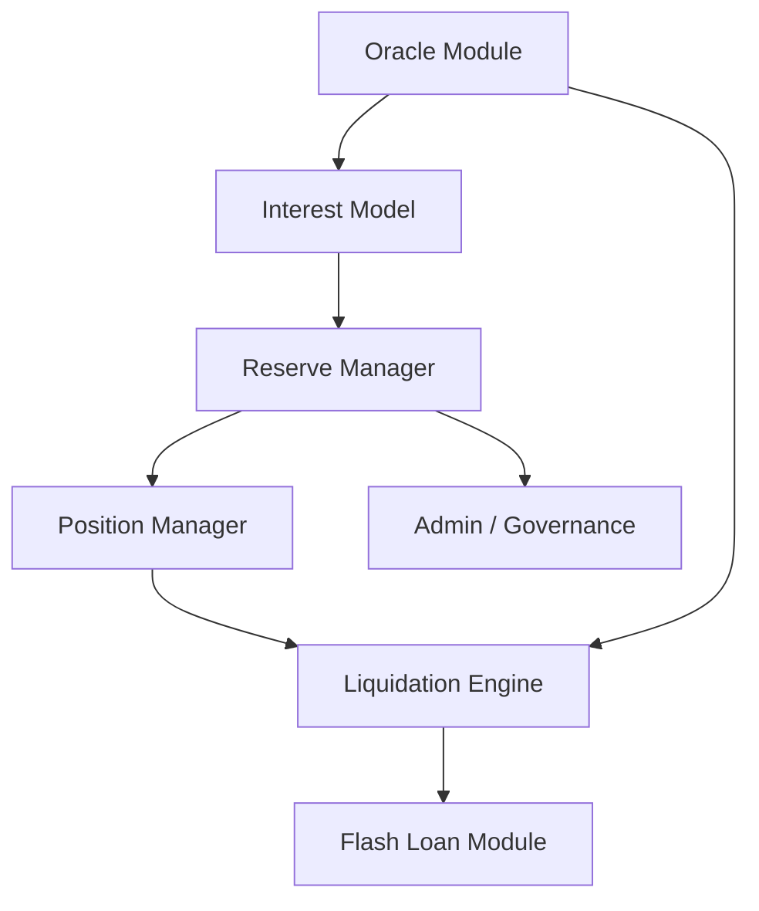

# 6.6 Sui 借贷协议案例

## 生产级借贷协议的完整架构

从 Sui Savings 的教学原型到生产级借贷协议，需要以下组件：

## Suilend

Suilend 是 Solend 团队在 Sui 上部署的借贷协议。核心特点：
- 支持多资产市场
- 隔离市场设计——不同资产对有独立的风险参数
- 灵活的利率曲线配置

## Scallop

Sui 原生借贷协议。核心特点：
- 0% 利率市场——支持稳定币对的无息借贷
- 预言机价格安全校验
- Sui Move 原生实现，充分利用对象模型

## Navi Protocol

Sui 生态的综合性借贷协议。核心特点：
- 跨市场借贷
- 自动杠杆功能
- 与其他 Sui DeFi 协议的深度整合

## 安全清单

评估一个借贷协议时，检查以下要点：

| 检查项 | 说明 |
|--------|------|
| 预言机来源 | 是否使用多源预言机？是否有 TWAP 保护？ |
| 利率模型 | 拐点参数是否合理？极端利用率下的利率是否够高？ |
| 清算激励 | 清算罚金是否足以吸引清算者？是否有清算上限？ |
| 暂停机制 | 是否有紧急暂停功能？暂停权限是否受控？ |
| 存款上限 | 是否有单市场和全局存款上限？ |
| 借款上限 | 是否有单资产借款上限？ |
| 坏账处理 | 坏账如何处理？是否有储备金？ |
| 治理权限 | 管理员能做什么？参数修改是否需要时间锁？ |
