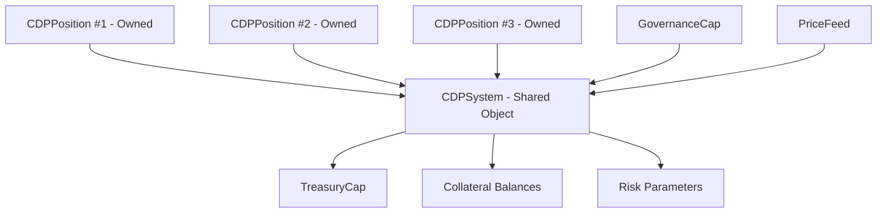

# 9.4 Sui 稳定币实现路径与难点

## 三种实现路径

### 单资产 CDP

只接受一种抵押品（如 SUI）。实现简单，风险可控。

```move
public struct SingleAssetCDP {
    collateral_type: u8, // 只有一种
    system: CDPSystem,
}
```

缺点：如果 SUI 大幅下跌，所有仓位同时面临清算，系统性风险高。

### 多资产 CDP

接受多种抵押品（SUI、USDC、ETH 等）。每种资产有独立的风险参数。

```move
public struct MultiAssetCDP {
    collateral_type: u8,
    asset_params: vector<AssetParams>,
}

public struct AssetParams {
    collateral_ratio_bps: u64,
    liquidation_threshold_bps: u64,
    debt_ceiling: u64,
    stability_fee_bps: u64,
}
```

优点：分散了单一资产风险。缺点：参数管理复杂，资产间相关性可能放大风险。

### 分层仓位模型

用户可以为不同操作创建独立的 CDP 仓位，而不是一个全局仓位。

```move
public struct CDPPosition has key, store {
    id: UID,
    owner: address,
    collateral_coin_type: u8,
    collateral_amount: u64,
    debt_amount: u64,
}
```

Sui 的对象模型天然适合这种设计——每个 CDPPosition 是一个独立的 Owned Object。

## 对象关系图



## 三大设计难点

### 1. 预言机的关键性

CDP 的每一个核心操作都依赖价格：开仓检查抵押率、清算判断是否触发、计算清算罚金。预言机失效 = 系统失效。

### 2. 共享对象的治理压力

CDPSystem 是共享对象，所有操作都要修改它。在高并发时（大量用户同时开仓/清算），会产生 Gas 竞争。

Sui 的并行执行可以部分缓解，但 CDPSystem 的全局状态（total_debt、collateral_balance）仍然是瓶颈。可能的解决方案：
- 分片：按资产类型或用户地址分片为多个子系统
- 延迟更新：某些统计值不实时更新，而是定期快照

### 3. 清算的非纯技术属性

清算不是一个纯技术问题。它取决于：
- 市场上是否有足够的清算者（需要激励）
- 清算者能否快速卖出抵押品（需要 DEX 流动性）
- 清算罚金是否足以覆盖成本（需要参数设计）

最好的清算代码，如果没有清算者愿意执行，也等于没有清算。
