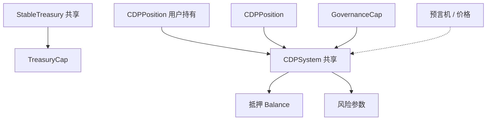

# 9.7 Sui 上的稳定币实现路径与难点

在 **9.2–9.6** 中，我们分别覆盖了法币抵押的链上角色、CDP 的机制与实现、以及算法路线的概念与极简状态机。本节从**工程落地**角度，归纳在 Sui 上扩展稳定币协议时的典型路径与瓶颈。

## 实现路径（以 CDP 为主）

### 单资产 CDP

只接受一种抵押品（如 SUI）。实现路径最短，适合教学与早期主网实验。

- **优点**：参数少、审计面清晰。
- **缺点**：抵押品单一，系统性风险集中——行情大跌时清算与坏账压力同步上升。

### 多资产 CDP

对每种抵押品使用独立的 `CDPSystem<Collateral>`（本书 `cdp_stablecoin` 已采用泛型拆分系统），各设 `debt_ceiling`、抵押率与清算阈值。

- **优点**：风险分散，可引入相关性较低的资产。
- **缺点**：治理与参数运维复杂度显著上升；相关性在危机中可能同步飙升（「分散」并非天然成立）。

### 仓位级对象模型

Sui 上每个 `CDPPosition` 可作为 **owned object** 管理，用户持有自己的仓位 NFT 式对象，适合与钱包、策略模块组合。

## 对象关系（示意）

## 三大工程难点

### 1. 预言机

开仓、清算、罚金几乎每一步都依赖价格。预言机延迟、被操纵或停更，会直接转化为坏账风险（与第 **5**、**22** 章联动）。

### 2. 共享对象与吞吐

`CDPSystem`、`StableTreasury` 等共享对象在高峰期可能成为热点；需要产品层设计（分池、队列、延迟统计）而不仅是合约层「一行搞定」。

### 3. 清算的市场结构

清算代码正确 ≠ 清算会发生。清算人是否有利可图、DEX 是否有足够深度承接抵押品卖出，决定了协议在危机中是否「跑得动」。

## 法币与算法路线的补充一句

- **法币抵押**：在 Sui 上多为官方或桥接 `Coin` 集成，难点在合规与资产来源，而非单池数学。
- **算法**：链上模块可以很薄，但**经济可持续**与**压力测试**才是主战场；勿与 CDP 的「可验证抵押」混为一谈。

下一节（**9.8**）讨论从机制正确到**系统可信度**的完整框架。
