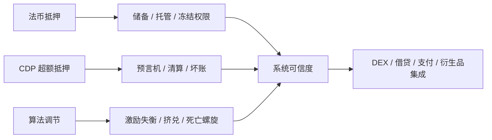

# 第 9 章 稳定币：法币抵押 · CDP · 算法

稳定币是 DeFi 的「记账单位」与主要交易媒介。实现路径不同，**信任假设与失败模式**也完全不同。本章按三条主线展开，并在每条主线下配合**概念说明 + 代码导读**：

1. **法币抵押**（如 USDC 类）：链下储备 + 链上受控铸销——代码薄、合规与对手方风险厚。
2. **加密抵押 CDP**（如 DAI 类）：超额抵押 + 债务 + 清算——链上逻辑厚，本书 **Move 主实现**所在。
3. **算法 / 部分抵押**：规则调节供给与预期——历史上高压案例多，本书以**极简教学模块**展示状态机，不作为「可上线完整方案」。

## 本章目录

| 小节 | 内容                                                                |
| ---- | ------------------------------------------------------------------- |
| 9.1  | 三条路线总览与本章读法                                              |
| 9.2  | 法币抵押：储备、托管与链上最小模型（`fiat_stablecoin_sketch`）      |
| 9.3  | 法币稳定币与 Sui 生态                                               |
| 9.4  | CDP：锚定、套利与风险参数                                           |
| 9.5  | CDP Move 实现导读（`cdp_stablecoin`）                               |
| 9.6  | 算法稳定币：谱系、教训与教学代码（`algorithmic_stablecoin_sketch`） |
| 9.7  | Sui 实现路径与工程难点                                              |
| 9.8  | 系统可信度：超越「机制正确」                                        |

## 代码包一览

| 包                              | 路径                                  | 说明                                        |
| ------------------------------- | ------------------------------------- | ------------------------------------------- |
| `fiat_stablecoin_sketch`        | `code/fiat_stablecoin_sketch/`        | 发行方 `IssuerCap` + `TreasuryCap` 铸销模型 |
| `cdp_stablecoin`                | `code/cdp_stablecoin/`                | 完整 CDP：多抵押品、`CDPPosition`、清算     |
| `algorithmic_stablecoin_sketch` | `code/algorithmic_stablecoin_sketch/` | 名义供给 / 准备金 / peg 示意状态机          |

阅读前请建立预期：**法币与算法示例用于建立直觉；生产级安全与合规不在本章范围内。**

## 三条稳定路径的风险地图

稳定币章节的阅读重点不是比较哪条路线“更去中心化”，而是识别每条路线把风险放在哪里。法币路线把风险放在链下储备与发行方，CDP 路线把风险放在抵押品价格和清算深度，算法路线把风险放在市场预期和激励闭环。

## 本章目标

- 比较法币抵押、CDP、算法稳定币三条路线的信任假设。
- 理解 CDP 的抵押、债务、清算与锚定套利。
- 掌握稳定币系统从机制正确到系统可信所需的储备、治理和风控条件。
- 能阅读本章三个教学代码包并区分其生产边界。

## 先修知识

- 理解借贷清算和预言机安全读取。
- 了解 `TreasuryCap`、`Coin<T>` 和 Capability 权限模式。

## 本章小结

稳定币不是“价格固定的 Coin”，而是一套维持购买力预期的制度安排。法币路线重在链下信用，CDP 路线重在超额抵押和清算，算法路线则必须面对激励和死亡螺旋风险。

## 练习题

1. 比较 USDC 类稳定币和 CDP 稳定币的最大信任边界。
2. 用一个价格下跌例子说明 CDP 为什么需要清算。
3. 为 CDP 系统列出三个必须公开的参数。
4. 解释为什么算法稳定币教学代码不能被描述成生产协议。

## 下一章连接

货币与信用之后，第四篇进入收益与杠杆，先从 Sui 质押收益和 LST 开始。
