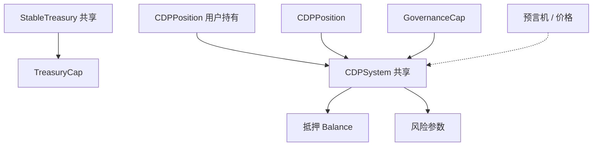

# 9.7 Sui 上的稳定币实现路径与难点

在 **9.2–9.6** 中，我们分别覆盖了法币抵押的链上角色、CDP 的机制与实现、以及算法路线的概念与极简状态机。本节从**工程落地**角度，归纳在 Sui 上扩展稳定币协议时的典型路径与瓶颈。

## 实现路径（以 CDP 为主）

### 单资产 CDP

只接受一种抵押品（如 SUI）。实现路径最短，适合教学与早期主网实验。

- **优点**：参数少、审计面清晰。
- **缺点**：抵押品单一，系统性风险集中——行情大跌时清算与坏账压力同步上升。

### 多资产 CDP

对每种抵押品使用独立的 `CDPSystem<Collateral>`（本书 `cdp_stablecoin` 已采用泛型拆分系统），各设 `debt_ceiling`、抵押率与清算阈值。

- **优点**：风险分散，可引入相关性较低的资产。
- **缺点**：治理与参数运维复杂度显著上升；相关性在危机中可能同步飙升（「分散」并非天然成立）。

### 仓位级对象模型

Sui 上每个 `CDPPosition` 可作为 **owned object** 管理，用户持有自己的仓位 NFT 式对象，适合与钱包、策略模块组合。

## 对象关系（示意）



## 三大工程难点

### 1. 预言机

开仓、清算、罚金几乎每一步都依赖价格。预言机延迟、被操纵或停更，会直接转化为坏账风险（与第 **5**、**22** 章联动）。

### 2. 共享对象与吞吐

`CDPSystem`、`StableTreasury` 等共享对象在高峰期可能成为热点；需要产品层设计（分池、队列、延迟统计）而不仅是合约层「一行搞定」。

### 3. 清算的市场结构

清算代码正确 ≠ 清算会发生。清算人是否有利可图、DEX 是否有足够深度承接抵押品卖出，决定了协议在危机中是否「跑得动」。

## 法币与算法路线的补充一句

- **法币抵押**：在 Sui 上多为官方或桥接 `Coin` 集成，难点在合规与资产来源，而非单池数学。
- **算法**：链上模块可以很薄，但**经济可持续**与**压力测试**才是主战场；勿与 CDP 的「可验证抵押」混为一谈。

下一节（**9.8**）讨论从机制正确到**系统可信度**的完整框架。

## 从教学到生产：CDP 协议的扩展方向

本书的 `cdp_stablecoin` 代码是教学级实现。生产级 CDP 还需要考虑：

### 多抵押品支持

```move
// 教学版：单一系统
public struct CDPSystem<Collateral> has key { ... }

// 生产版：注册表模式
public struct StablecoinProtocol has key {
    treasury: TreasuryCap<USDs>,
    systems: Bag,                    // Collateral type → CDPSystem
    global_debt_ceiling: u64,
    global_debt: u64,
}

public fun register_collateral<T>(
    _: &GovernanceCap,
    protocol: &mut StablecoinProtocol,
    params: CollateralParams,
    ctx: &mut TxContext,
) {
    // 为每种抵押品创建独立系统
    let system = CDPSystem<T> { ... };
    dynamic_field::add(&mut protocol.systems, type_name<T>(), system);
}
```

### 稳定费机制

生产级 CDP 通常对债务收取稳定费（类似利率）：

```move
public struct CDPSystem<Collateral> has key {
    // ... 其他字段
    stability_fee_bps: u64,      // 年化稳定费（基点）
    last_fee_epoch: u64,         // 上次收费 epoch
    accrued_fees: Balance<USDs>, // 累积的费用
}

// 每次操作前调用，累积自上次以来的费用
public fun accrue_fees<Collateral>(
    system: &mut CDPSystem<Collateral>,
    current_epoch: u64,
) {
    let epochs_elapsed = current_epoch - system.last_fee_epoch;
    if (epochs_elapsed > 0) {
        let fee = system.total_debt * system.stability_fee_bps * epochs_elapsed / (10000 * 365);
        // 从债务中收取（增加 total_debt 或直接从 treasury 铸造）
    }
}
```

### 清算的深度分析

清算不仅需要代码正确，还需要**市场结构**支持：

```
清算是否有效取决于：
1. 清算人是否有利可图？
   - 清算折扣 > Gas + 交易成本 + 滑点
   - 如果折扣太低，清算人不会来
   - 如果折扣太高，借款人损失过大

2. 清算后的抵押品能否卖出？
   - DEX 上是否有足够的流动性？
   - 大量清算导致的价格冲击是否会制造更多坏账？

3. 清算是否及时？
   - 预言机延迟会导致清算滞后
   - Gas 竞争可能导致清算交易被挤出
   - 如果多个仓位同时需要清算，排队如何处理？
```

### 坏账处理

当抵押品价值不足以覆盖债务时：

```move
public fun handle_bad_debt<Collateral>(
    system: &mut CDPSystem<Collateral>,
    treasury: &mut StableTreasury,
    amount: u64,
) {
    // 从保险基金中吸收坏账
    if (balance::value(&system.insurance_fund) >= amount) {
        let bad_coins = coin::mint(&mut treasury.cap, amount, ctx);
        coin::burn(bad_coins, &mut treasury.cap);
        balance::join(&mut system.insurance_fund, /* 从保险基金取 */);
    } else {
        // 保险基金不足：稀释所有持有者（最后手段）
        // 或者暂停协议等待治理决策
    }
}
```

坏账处理的策略决定了协议在极端行情下的韧性。每种策略都有利弊：

| 策略           | 优点               | 缺点                       |
| -------------- | ------------------ | -------------------------- |
| 保险基金吸收   | 不影响其他用户     | 基金可能耗尽               |
| 稀释铸造       | 分散到所有持有者   | 稳定币价值下降             |
| 治理兜底       | 灵活               | 响应慢，依赖治理参与       |
| 自动暂停       | 止损               | 无法应对正在发生的坏账     |
