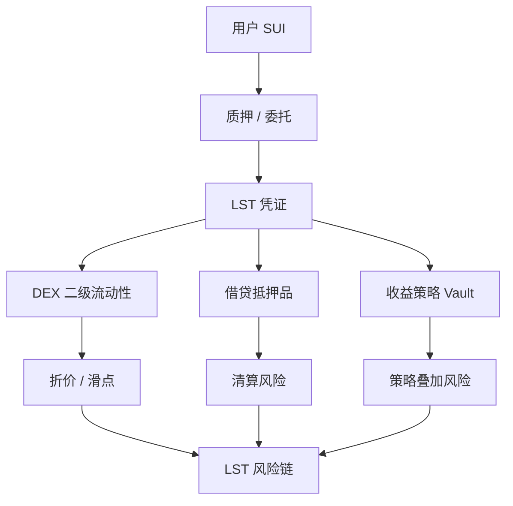

# 第 10 章 LSD 与收益层

## 质押收益如何变成可流通资产

LSD（Liquid Staking Derivative）解决一个基本矛盾：质押的资产被锁定无法使用，但 DeFi 需要这些资产参与流动性。

LST（Liquid Staking Token）是解决方案：它代表你质押的资产 + 累积的收益，并且可以在 DeFi 中自由流通。

## 本章结构

| 小节 | 核心问题                     |
| ---- | ---------------------------- |
| 10.1 | 收益从哪来？                 |
| 10.2 | LST 的 Move 实现与二次流动性 |
| 10.3 | 收益组合为什么不是简单加法   |
| 10.4 | Sui LSD 协议案例与风险链     |

## LST 的组合路径

LST 的关键问题是同一份底层质押收益会被多层协议反复包装。读本章时要持续追踪两个价格：赎回价值和二级市场价格。两者偏离越大，后续借贷、做市和收益金库的风险越难被简单 APR 解释。

## 本章目标

- 理解质押收益、验证者风险和流动性质押凭证的关系。
- 比较升值型 LST 与数量增长型 LST 的 DeFi 兼容性。
- 分析 LST 进入 DEX、借贷和收益策略后的风险叠加。
- 能判断 LST 抵押品价格应使用哪类价格源。

## 先修知识

- 理解 Sui 原生质押和 Coin/Balance 的基本模型。
- 理解 DEX 折价和借贷抵押率的风险传导。

## 本章小结

LSD 把质押收益包装成可组合资产，但它不是无风险利率。LST 的折价、赎回延迟、验证者集中度和二级流动性会沿着 DeFi 组合层层放大。

## 练习题

1. 比较 rebasing 和 non-rebasing LST 对借贷协议的影响。
2. 说明 LST/SUI 折价时用 SUI 价格做抵押估值的风险。
3. 画出用户从质押到获得 LST 再进入 DEX LP 的资产流。
4. 列出一个 LST 协议应公开的三个风险指标。

## 下一章连接

有了收益资产后，下一章讨论主动做市、收益金库和 Delta 中性策略。
