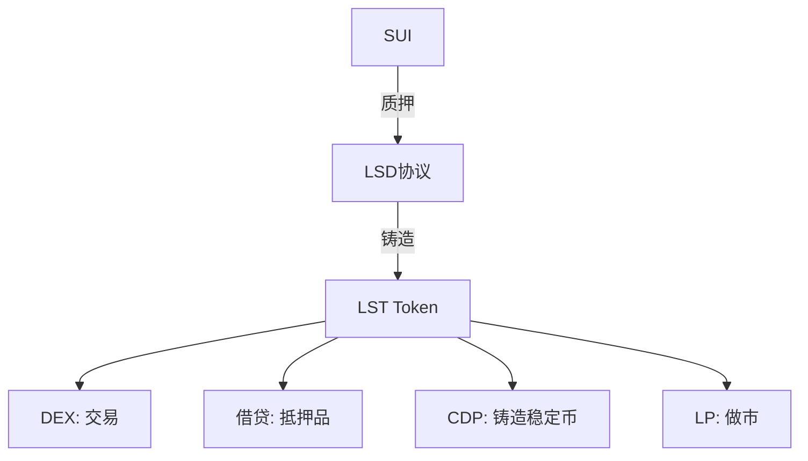

# 10.2 LST 凭证实现与二次流动性

## LST 的两种实现方式

### 1. Rebasing（升值型）

LST 的数量不变，但每个 LST 对应的 SUI 数量随时间增长。

```move
public struct StakedSUI has key {
    id: UID,
    principal: Balance<SUI>,
    pool_id: ID,
    activated_at_epoch: u64,
}

public fun exchange_rate(pool: &StakingPool): u64 {
    let total_staked = balance::value(&pool.staked_sui);
    let total_lsst = pool.total_lsst_supply;
    if (total_lsst == 0) { return 1000000000 };
    total_staked * 1000000000 / total_lsst
}

public fun redeem(pool: &mut StakingPool, lsst_amount: u64, ctx: &mut TxContext): Coin<SUI> {
    let rate = exchange_rate(pool);
    let sui_amount = lsst_amount * rate / 1000000000;
    pool.total_lsst_supply = pool.total_lsst_supply - lsst_amount;
    coin::take(&mut pool.staked_sui, sui_amount, ctx)
}
```

### 2. Non-rebasing（数量增长型）

LST 与 SUI 的兑换率固定为 1:1，但用户通过 staking_reward 获得额外的 LST。

```move
public struct LiquidStakingPool has key {
    id: UID,
    staked_sui: Balance<SUI>,
    lst_supply: u64,
    reward_pool: Balance<SUI>,
    last_reward_epoch: u64,
}

public fun stake(
    pool: &mut LiquidStakingPool,
    sui_coin: Coin<SUI>,
    ctx: &mut TxContext,
): LST {
    let amount = coin::value(&sui_coin);
    balance::join(&mut pool.staked_sui, coin::into_balance(sui_coin));
    pool.lst_supply = pool.lst_supply + amount;
    LST {
        id: object::new(ctx),
        amount,
    }
}

public fun claim_reward(
    pool: &mut LiquidStakingPool,
    lst: &LST,
    ctx: &mut TxContext,
): Coin<SUI> {
    let reward = calculate_reward(pool, lst);
    coin::take(&mut pool.reward_pool, reward, ctx)
}
```

## LST 承载的三种权利

1. **经济所有权**：LST 代表底层 SUI 的所有权
2. **未来收益**：LST 持有者获得质押收益
3. **赎回路径**：LST 可以兑换回 SUI

## LST 进入 DeFi 的路径



LST 的二次使用创造了收益叠加：质押收益 + 借贷利息 + LP 手续费。但这不是免费的——每增加一层使用，就增加了一层风险耦合。
