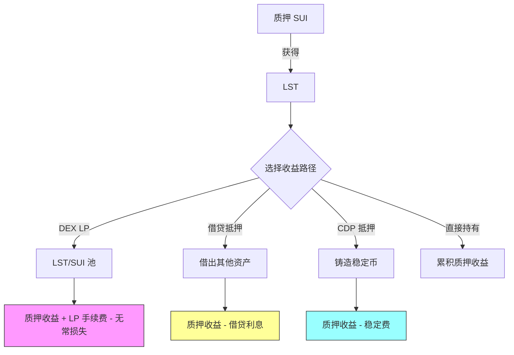

# 10.3 收益组合与风险叠加

## 组合收益 ≠ 简单加法

假设你有以下收益层：

- 质押收益：3% APY
- LP 手续费收益：5% APY
- 借贷利息（用 LST 作抵押借出后再投资）：2% APY

总 APY 不是 3% + 5% + 2% = 10%。你需要考虑：

### 净收益公式

$$Y_{net} = Y_{base} + Y_{market} + Y_{incentive} - C_{gas} - C_{risk} - C_{slippage}$$

- $Y_{base}$：基础收益（质押）
- $Y_{market}$：市场收益（LP 手续费、借贷利差）
- $Y_{incentive}$：激励收益（代币排放）
- $C_{gas}$：Gas 成本
- $C_{risk}$：风险成本（无常损失、清算风险、智能合约风险）
- $C_{slippage}$：滑点成本

## 收益稳定性分级

| 等级 | 类型       | 稳定性   | 例子           |
| ---- | ---------- | -------- | -------------- |
| L1   | 协议级收益 | 最稳定   | SUI 质押收益   |
| L2   | 市场级收益 | 中等     | LP 手续费      |
| L3   | 激励级收益 | 不稳定   | 流动性挖矿奖励 |
| L4   | 补贴级收益 | 最不稳定 | 限时双倍收益   |

## 杠杆收益的实际成本

用 LST 作抵押借出 SUI，再质押铸造 LST，再抵押借出...这就是杠杆质押循环。

每增加一层杠杆：

- 收益增加（更多的质押本金）
- 风险也增加（更接近清算线）
- Gas 成本增加
- 复杂度增加

```move
public fun leveraged_stake_cost(
    leverage_ratio: u64,
    borrow_rate_bps: u64,
    stake_rate_bps: u64,
) -> u64 {
    let gross_yield = leverage_ratio * stake_rate_bps;
    let borrow_cost = (leverage_ratio - 10000) * borrow_rate_bps;
    if (gross_yield > borrow_cost) {
        (gross_yield - borrow_cost) / leverage_ratio
    } else {
        0
    }
}
```

当 `borrow_cost > gross_yield` 时，杠杆就是在亏钱。

## 数值示例：杠杆质押的收益与风险

假设参数：
- 质押收益：3% APY
- 借贷利率：5% APY
- 初始本金：1000 SUI
- 杠杆倍数：2x（质押 1000 → 借出 1000 → 再质押）

**无杠杆**：
- 年收益：1000 × 3% = 30 SUI

**2x 杠杆**：
- 总质押：2000 SUI
- 质押收益：2000 × 3% = 60 SUI
- 借贷成本：1000 × 5% = 50 SUI
- 净收益：60 - 50 = 10 SUI（实际 APY 仅 1%）

如果 SUI 下跌 20%：
- 抵押品价值：2000 × 0.8 = 1600 SUI
- 债务：1000 SUI
- 健康因子：1600 / 1000 = 1.6

如果清算阈值为 1.3，还有 30% 的缓冲。但如果继续加杠杆到 3x：

- 总质押：3000 SUI
- 债务：2000 SUI
- SUI 下跌 20% 后：抵押品 2400，健康因子 2400/2000 = 1.2 < 1.3 → **触发清算**

这就是杠杆的代价：收益被借贷成本侵蚀，风险却指数级放大。

## LST 在 DeFi 中的收益层叠加

LST 进入 DeFi 后，收益来源变为复合结构：



关键观察：
- **所有路径的基础收益都是质押收益**：LST 的底色是「带收益的 SUI」
- **每增加一层使用就增加一层风险**：LP 有无常损失、借贷有清算风险、CDP 有预言机风险
- **风险是乘法关系，不是加法**：LST 协议风险 × DEX 风险 × 清算风险
