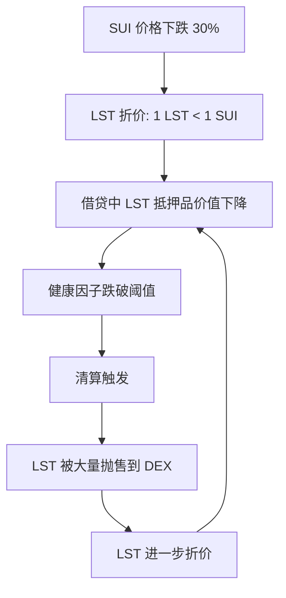

# 10.4 Sui LSD 协议案例与风险链

## Sui LSD 代表项目

| 项目      | LST 代币 | 模式         | 特点                    |
| --------- | -------- | ------------ | ----------------------- |
| Aftermath | afSUI    | Rebasing     | DeFi 一站式平台的一部分 |
| Haedal    | haSUI    | Rebasing     | 验证者集合治理          |
| Volo      | vSUI     | Non-rebasing | 固定兑换率              |

## 风险链分析

LSD 的风险不是独立的，它会通过 DeFi 的组合性传播：

## 风险分级

| 风险级别 | 类型       | 描述                     | 应对策略            |
| -------- | ---------- | ------------------------ | ------------------- |
| L1       | 价格风险   | SUI 本身的价格波动       | 分散投资            |
| L2       | 流动性风险 | LST 在 DEX 上的深度不足  | 选择高流动性 LST    |
| L3       | 协议风险   | LSD 协议的智能合约漏洞   | 选择经过审计的协议  |
| L4       | 耦合风险   | LST 同时在多个协议中使用 | 限制 LST 的使用层级 |

## 选择 LST 的标准

1. **流动性**：DEX 上的 LST/SUI 池子深度
2. **折价历史**：LST 历史上偏离 1:1 的幅度和恢复速度
3. **验证者分布**：LSD 协议背后的验证者是否分散
4. **审计状态**：是否经过审计，审计方是谁
5. **DeFi 集成**：被多少其他协议接受为抵押品

## LST 作为抵押品时的特殊风险

当 LST 被借贷协议接受为抵押品时，出现**双重价格风险**：

1. **SUI 价格下跌** → LST 价值下跌 → 触发清算
2. **LST 折价加剧** → 即使 SUI 价格不变，LST 相对 SUI 的汇率也下跌 → 触发清算

借贷协议需要决定：LST 的价格来源是 SUI 的预言机价格（忽略折价）还是 LST/SUI 的 DEX 市场价？前者在折价时会产生坏账，后者会过度清算。

### LST 折价的典型场景

| 场景             | 机制                                             | 恢复条件             |
| ---------------- | ------------------------------------------------ | -------------------- |
| 大额赎回冲击     | 大量用户同时 unstake，池子 SUI 不足              | 等待 epoch 解锁      |
| 协议安全事件     | 合约漏洞传闻导致抛售                             | 审计澄清、修复发布   |
| 验证者被 slashing | 质押本金受损，LST 对应的 SUI 减少                | 无法恢复（已损失）   |
| 流动性枯竭       | DEX 池深度不足，大户卖出导致大幅滑点              | 做市商介入或套利     |
| 跨链桥依赖风险   | 如果 LST 依赖跨链机制，桥出问题会影响 LST 信心   | 桥恢复正常运营       |

## LSD 对 Sui 网络安全的影响

LSD 带来一个系统性问题：**质押的 SUI 越多通过 LSD 流动，验证者之间的竞争可能越不敏感**。

- **正面**：LSD 降低了质押门槛，更多 SUI 被质押，网络更安全
- **负面**：如果大部分质押集中在少数 LSD 协议，这些协议的验证者选择会显著影响网络去中心化程度
- **关键指标**：LSD 协议是否支持用户**指定验证者**，还是由协议统一分配

开发者关注点：当你的 DeFi 协议决定是否接受 LST 作为抵押品时，不仅看折价历史和流动性，还要评估该 LSD 协议对 Sui 网络去中心化的影响——**系统性风险会回传到每个使用该 LST 的协议**。
