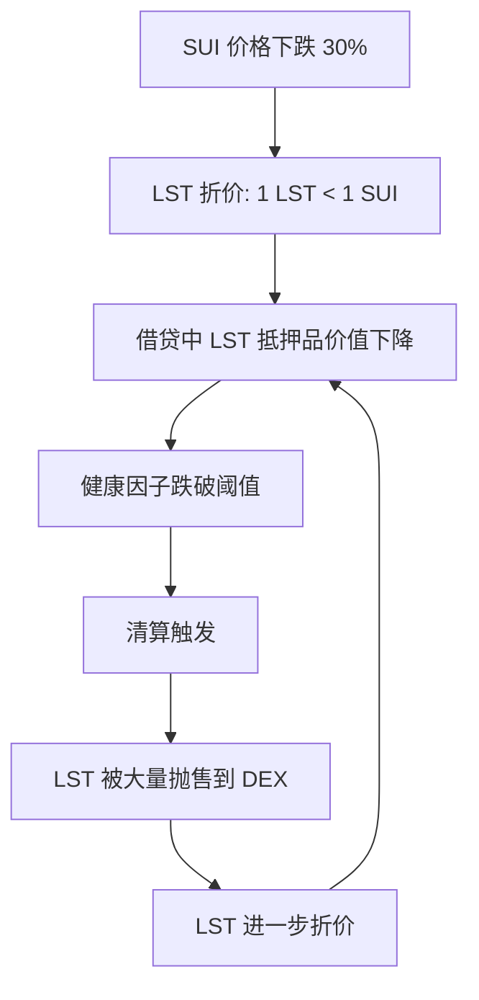

# 10.4 Sui LSD 协议案例与风险链

## Sui LSD 代表项目

| 项目 | LST 代币 | 模式 | 特点 |
|------|----------|------|------|
| Aftermath | afSUI | Rebasing | DeFi 一站式平台的一部分 |
| Haedal | haSUI | Rebasing | 验证者集合治理 |
| Volo | vSUI | Non-rebasing | 固定兑换率 |

## 风险链分析

LSD 的风险不是独立的，它会通过 DeFi 的组合性传播：

## 风险分级

| 风险级别 | 类型 | 描述 | 应对策略 |
|----------|------|------|----------|
| L1 | 价格风险 | SUI 本身的价格波动 | 分散投资 |
| L2 | 流动性风险 | LST 在 DEX 上的深度不足 | 选择高流动性 LST |
| L3 | 协议风险 | LSD 协议的智能合约漏洞 | 选择经过审计的协议 |
| L4 | 耦合风险 | LST 同时在多个协议中使用 | 限制 LST 的使用层级 |

## 选择 LST 的标准

1. **流动性**：DEX 上的 LST/SUI 池子深度
2. **折价历史**：LST 历史上偏离 1:1 的幅度和恢复速度
3. **验证者分布**：LSD 协议背后的验证者是否分散
4. **审计状态**：是否经过审计，审计方是谁
5. **DeFi 集成**：被多少其他协议接受为抵押品
