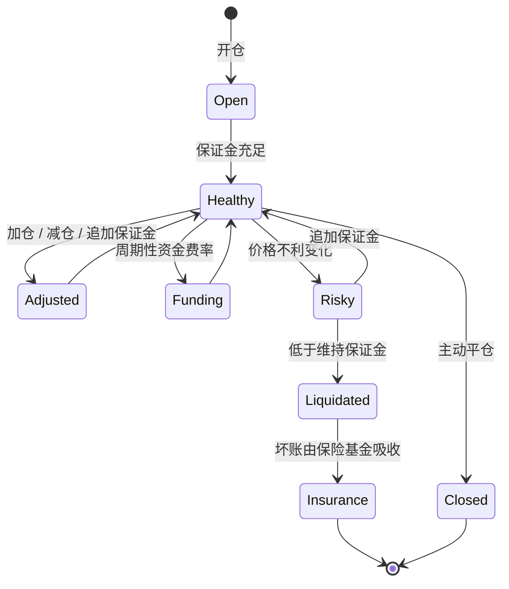

# 第 12 章 衍生品：永续合约与期货

## 持有资产 vs 持有敞口

现货交易：你买入 1 BTC，你持有 1 BTC。你的盈亏完全取决于 BTC 价格变化。

衍生品交易：你获得 BTC 的价格敞口，但你不持有 BTC。你可以在没有 BTC 的情况下做空 BTC。

这个区别是理解衍生品的核心——**衍生品交易的是价格风险，不是资产本身。**

## 永续合约生命周期

本章需要同时跟踪四条线：用户权益、仓位名义价值、预言机/标记价格和保险基金余额。任何一条线设计粗糙，都会把“杠杆交易”变成“谁先跑谁少亏”的清算竞赛。

## 本章结构

| 小节 | 内容 |
| ---- | ---- |
| 12.1 | 现货、期货、永续合约与 PnL 计算 |
| 12.2 | `PerpMarket` 教学实现：开仓、减仓、强平、资金费率 |
| 12.3 | 保证金、杠杆与完整强平生命周期 |
| 12.4 | Sui 衍生品协议案例与风控清单 |

## 本章目标

- 区分持有资产和持有价格敞口。
- 理解永续合约的保证金、杠杆、PnL、资金费率和保险基金。
- 掌握强平价格、部分平仓和坏账吸收的基本逻辑。
- 能阅读教学版 PerpMarket 并指出它距离生产系统的缺口。

## 先修知识

- 理解预言机价格、借贷清算和风险参数。
- 能阅读有符号盈亏和保证金比例计算。

## 本章小结

衍生品把价格风险从资产持有中拆出来，并用保证金系统管理违约风险。永续合约看似只是多空交易，实际依赖价格源、资金费率、保险基金、清算人和撮合/流动性设计共同稳定。

## 练习题

1. 用 10x 多单计算价格下跌 5% 时的权益变化。
2. 解释标记价格和成交价格为什么不能混用。
3. 设计一个保险基金耗尽后的处理顺序。
4. 说明资金费率可能被操纵的前提。

## 下一章连接

衍生品直接提供杠杆；下一章看现货和借贷如何组合出杠杆交易。
