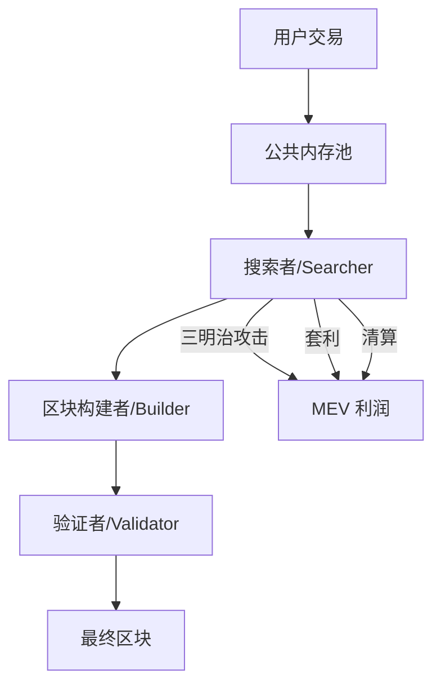

# 14.7 套利竞争、MEV 与公平性

## 套利者的竞争

当一个套利机会出现时，谁先执行谁获利。这导致了**优先 Gas 拍卖（PGA）**——套利者通过支付更高的 Gas 来抢夺交易排序。

```
套利机会出现（价差 2%）
  ↓
套利者 A: Gas 优先费 $5
套利者 B: Gas 优先费 $8  ← 赢得排序
套利者 C: Gas 优先费 $12 ← 如果 B 失败则接替
  ↓
利润被 Gas 竞争侵蚀:
  毛利 $100 → Gas $80 → 净利 $20
```

极限情况下，所有套利利润都被 Gas 竞争消耗——套利者不赚钱，矿工/验证者赚了所有利润。

## MEV 生态



| 角色                | 职责                      | 收入来源              |
| ------------------- | ------------------------- | --------------------- |
| 搜索者（Searcher）  | 发现 MEV 机会，构建交易包 | MEV 利润              |
| 构建者（Builder）   | 将交易包组装成区块        | 搜索者支付的小费      |
| 验证者（Validator） | 选择并最终确定区块        | 区块奖励 + 构建者支付 |

## Flashbots 与私有交易池

### EVM 上的解决方案

Flashbots 引入了私有交易池：

- 用户交易不进入公共内存池
- 搜索者通过私有通道提交交易包
- 构建者通过拍卖选择最优交易包
- 减少了三明治攻击和 PGA

### Sui 上的 MEV 现状

Sui 目前没有原生的小费市场或 Flashbots 等价物。MEV 提取主要通过：

- 自由竞争（先到先得）
- Sui 的并行执行降低了排序竞争的强度

Sui 社区正在讨论 MEV 相关提案，包括：

- 可验证的延迟函数（VDF）来随机化交易排序
- 应用级别的反 MEV 设计（如意图架构）
- 验证者层面的 MEV 分享机制

## 公平性问题

| 问题                  | 描述                         |
| --------------------- | ---------------------------- |
| 抢跑（Front-running） | 看到别人的交易后抢先执行     |
| 尾随（Back-running）  | 跟随知情交易获利             |
| 三明治                | 前后夹击普通用户             |
| Just-in-Time 流动性   | 在大额交易前临时挂单吃手续费 |
| 状态腐败              | 验证者故意排序以获利         |

## 对协议设计者的启示

1. **不要假设交易顺序是公平的**——设计协议时假设有人能看到你的内存池交易
2. **使用 TWAP 而不是即时价格**——降低操纵动机
3. **实现滑点保护**——让用户设定最低输出量
4. **考虑批量拍卖**——所有交易在同一价格结算
5. **关注意图架构**——用户表达"我想要什么"而非"怎么做"

## MEV 的两面性

| 正面                   | 负面                         |
| ---------------------- | ---------------------------- |
| 消除价差，提升市场效率 | 三明治攻击损害用户           |
| 执行清算，保护协议安全 | PGA 浪费 Gas，抬高网络费用   |
| 为验证者提供额外收入   | 中心化风险（专业搜索者主导） |
| 推动协议设计进步       | 普通用户被"隐形征税"         |

MEV 不是纯粹的好或坏。它是区块链透明性的必然结果。好的协议设计应该最大化 MEV 的正面作用（套利、清算），最小化负面影响（三明治、PGA）。
