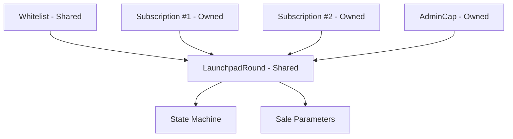

# 15.4 Sui Launchpad 完整案例

## 对象结构总览

## 四层对象设计

| 层 | 对象 | 类型 | 用途 |
|----|------|------|------|
| 1 | LaunchpadRound | Shared | 状态机 + 参数 |
| 2 | Whitelist | Shared | 白名单管理 |
| 3 | Subscription | Owned | 用户认购凭证 |
| 4 | AdminCap | Owned | 管理权限 |

## 与市场表现的关系

Launchpad 的职责是**公平地发行代币**，不是保证代币在二级市场的表现。

一个设计良好的 Launchpad 应该：
- 让符合条件的用户公平地获得代币
- 通过归属机制避免开盘时的集中抛售
- 清晰地公示所有参数和规则

它不应该：
- 承诺代币价格
- 通过人为稀缺性制造 FOMO
- 隐藏归属时间表

## Sui 上的 Launchpad 项目

Sui 上的 Launchpad 项目（如 SuiPad、Aftermath Launchpad）通常具备以下特征：
- 链上白名单验证
- 多种配售模式
- 内置归属机制
- 与 Sui 生态的其他 DeFi 协议集成（如认购获得的代币可以直接质押）
