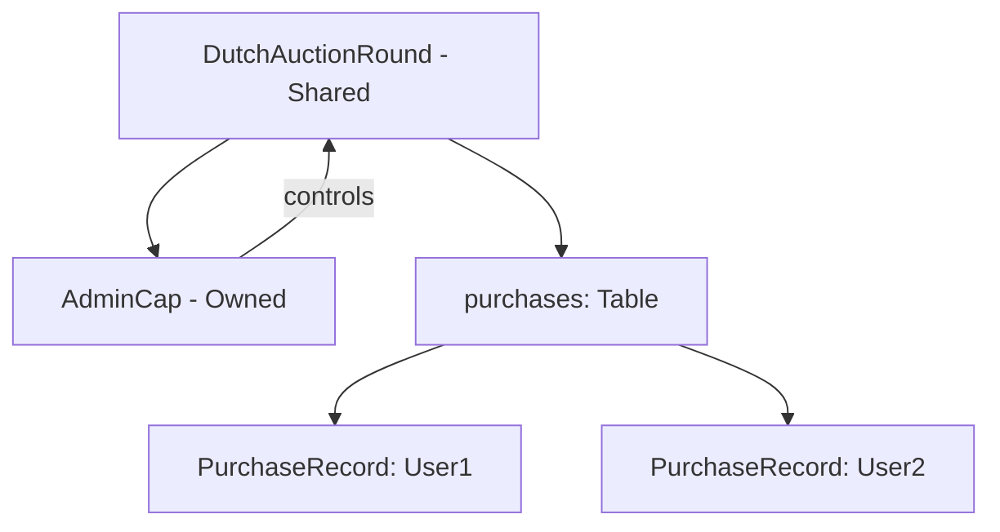

# 15.4 Move 实现荷兰式拍卖

## 数据结构设计

```
┌─────────────────────────────────────────────┐
│         DutchAuctionRound (Shared)          │
├─────────────────────────────────────────────┤
│ treasury_cap: TreasuryCap<DAUC>             │
│ payment_collected: Balance<SUI>             │
│ state: CREATED | ACTIVE | SETTLED | CANCEL  │
│ start_price: 10 SUI                         │
│ end_price:   2 SUI                          │
│ start_time:  1700000000000                  │
│ duration_ms: 3600000 (1h)                   │
│ total_supply: 1_000_000 tokens              │
│ remaining:   998_000 tokens                 │
│ purchases: Table<address, PurchaseRecord>   │
├─────────────────────────────────────────────┤
│        AdminCap (Owned by Admin)            │
└─────────────────────────────────────────────┘
```

每个买家对应一个 `PurchaseRecord`：

```move
public struct PurchaseRecord has store {
    token_amount: u64,    // 获得的代币数量
    total_payment: u64,   // 支付的 SUI 总额
    claimed: bool,        // 是否已领取代币
}
```

## 核心函数

### `current_price` — 实时价格计算

```move
public fun current_price(auction: &DutchAuctionRound, clock: &Clock): u64 {
    let now = clock.timestamp_ms();
    let elapsed = now - auction.start_time;
    if (elapsed >= auction.duration_ms) {
        auction.end_price
    } else {
        auction.start_price
            - (auction.start_price - auction.end_price) * elapsed / auction.duration_ms
    }
}
```

关键点：
- 使用 `Clock` 共享对象获取链上时间，而非 `tx_context`
- 整数运算先乘后除，避免精度损失
- `elapsed >= duration` 时锁定在地板价

### `buy` — 购买逻辑

```move
public fun buy(
    auction: &mut DutchAuctionRound,
    payment: Coin<SUI>,
    clock: &Clock,
    ctx: &mut TxContext,
) {
    // 1. 验证状态
    assert!(auction.state == STATE_ACTIVE, EWrongState);

    // 2. 计算当前价格
    let price = current_price(auction, clock);

    // 3. 根据支付金额计算代币数量
    let payment_amount = coin::value(&payment);
    let token_amount = payment_amount / price;
    assert!(token_amount > 0, EInsufficientPayment);
    assert!(token_amount <= auction.remaining, ESoldOut);

    // 4. 记录购买（支持多次购买）
    if (auction.purchases.contains(buyer)) {
        let record = auction.purchases.borrow_mut(buyer);
        record.token_amount = record.token_amount + token_amount;
        record.total_payment = record.total_payment + payment_amount;
    } else {
        auction.purchases.add(buyer, PurchaseRecord { ... });
    };

    // 5. 更新剩余量，卖完自动结算
    auction.remaining = auction.remaining - token_amount;
    if (auction.remaining == 0) {
        auction.state = STATE_SETTLED;
    };
}
```

### `claim` — 领取代币

拍卖结算后，买家调用 `claim` 领取代币：

```move
public fun claim(auction: &mut DutchAuctionRound, ctx: &mut TxContext): Coin<DAUC> {
    assert!(auction.state == STATE_SETTLED, EWrongState);
    let record = auction.purchases.borrow_mut(ctx.sender());
    assert!(!record.claimed, EAlreadyClaimed);
    record.claimed = true;
    coin::mint(&mut auction.treasury_cap, record.token_amount, ctx)
}
```

## 完整生命周期

```
1. Admin   → start_auction()    CREATED → ACTIVE
2. Buyer   → buy() @ t=900s     price = 8 SUI → gets 125 tokens
3. Buyer   → buy() @ t=1800s    price = 6 SUI → gets 166 tokens
4. Admin   → end_auction()      ACTIVE → SETTLED
5. Buyer   → claim()            mint & transfer tokens
6. Admin   → withdraw_payments() collect SUI
```

## 对象关系图



## 状态机

```
CREATED → ACTIVE → SETTLED
   ↓        ↓
CANCELLED  CANCELLED
```

| 状态 | 可调用 |
|------|--------|
| CREATED | start_auction, cancel |
| ACTIVE | buy, current_price, end_auction, cancel |
| SETTLED | claim, withdraw_payments |
| CANCELLED | refund |
