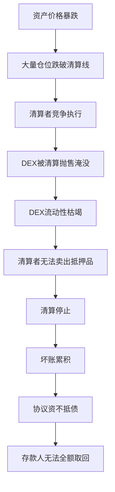

# 17.4 清算失效与级联崩盘

## 清算者为什么缺席

清算不是自动发生的——它需要有人（清算机器人）来执行。清算者缺席的三个原因：

### 1. Gas 竞争

当大量仓位同时需要清算时，清算者之间竞争 Gas。Gas 价格飙升，清算利润被 Gas 成本吞噬。

### 2. 抵押品无流动性

清算者获得抵押品后需要卖出获利。如果 DEX 上的流动性不足，清算者卖不出好价格。

### 3. 清算无利润

清算罚金（如 5%）可能不足以覆盖 Gas 成本 + 滑点损失。

## 级联崩盘的路径



## Move 中的清算防御设计

### 清算激励

```move
public struct LiquidationConfig has store {
    penalty_bps: u64,
    min_penalty: u64,
    max_penalty: u64,
    gas_rebate: u64,
}

public fun calculate_liquidation_incentive(
    config: &LiquidationConfig,
    debt_value: u64,
    collateral_value: u64,
    gas_price: u64,
): u64 {
    let base_penalty = debt_value * config.penalty_bps / 10000;
    let dynamic_penalty = gas_price * config.gas_rebate;
    let penalty = base_penalty + dynamic_penalty;
    if (penalty < config.min_penalty) { config.min_penalty }
    else if (penalty > config.max_penalty) { config.max_penalty }
    else { penalty }
}
```

动态调整清算罚金：Gas 高时增加激励，确保清算者始终有利润。

### 熔断机制

```move
public struct CircuitBreaker has store {
    max_liquidations_per_epoch: u64,
    current_count: u64,
    current_epoch: u64,
    cooldown_epochs: u64,
    triggered: bool,
}

public fun check_circuit_breaker(cb: &mut CircuitBreaker, epoch: u64): bool {
    if (epoch != cb.current_epoch) {
        cb.current_count = 0;
        cb.current_epoch = epoch;
        if (cb.triggered && epoch >= cb.current_epoch + cb.cooldown_epochs) {
            cb.triggered = false;
        };
    };
    if (cb.triggered) { return false };
    cb.current_count = cb.current_count + 1;
    if (cb.current_count >= cb.max_liquidations_per_epoch) {
        cb.triggered = true;
    };
    true
}
```

### 保险基金

```move
public fun cover_bad_debt(
    insurance: &mut Balance<Quote>,
    reserve: &mut Balance<Quote>,
    debt_amount: u64,
): bool {
    let insurance_balance = balance::value(insurance);
    if (insurance_balance >= debt_amount) {
        let coverage = balance::split(insurance, debt_amount);
        balance::join(reserve, coverage);
        true
    } else {
        let coverage = balance::split(insurance, insurance_balance);
        balance::join(reserve, coverage);
        false
    }
}
```

## 历史教训

| 事件 | 根因 | 损失 | 教训 |
|------|------|------|------|
| 2020 Black Thursday (MakerDAO) | ETH 暴跌 + Gas 飙升 + 清算者缺席 | ~$8M 坏账 | 清算机制需要动态激励 |
| 2022 Venus (BNB) | 大户仓位过大，清算冲击市场 | 价格异常波动 | 单用户仓位上限 |
| 多起 DeFi 事件 | 清算抛售导致 DEX 流动性枯竭 | 级联清算 | 熔断机制 + 保险基金 |
