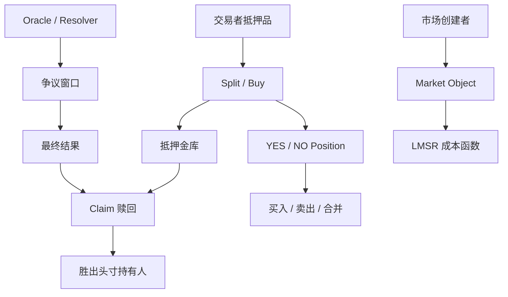

# 第 17 章 预测市场：从条件代币到 LMSR 与链上裁决

## 本章到底在教什么（先读这一段）

预测市场不是「又一个 Swap」，而是一套**事件结果 → 可交割头寸 → 可验证结算**的合约系统。把它写清楚，必须同时处理三件事：

1. **资产层**：抵押品如何变成互补的结果份额（条件代币 / 全集合），结算时谁从金库拿走什么。
2. **定价层**：在订单簿很薄时，谁来连续报价——本章用 **LMSR（对数市场评分规则）** 给出一种**完全链上可算**的自动做市；并如实说明它与主流商业产品在架构上的差别。
3. **裁决层**：链上最后一笔 `claim` 依赖「哪一边算赢」——这不是数学问题，是**权限、激励与争议流程**问题；实现上只能做到「状态机正确」，不能保证「事实正义」。

如果你读完觉得「好像什么都预测得到」，那是错觉：**本章刻意不把预测市场写成算命工具**；我们写的是**可审计的合约结构**与**可检验的定价数学**。

## 本章诚实的边界

| 我们**会**做                                        | 我们**不假装**已经做                               |
| --------------------------------------------------- | -------------------------------------------------- |
| 二元 + 多结果 LMSR 的数学与链上定点要点             | 与某商业产品 1:1 复刻其链下撮合与合规架构          |
| CTF 式 Split/Merge 不变量与 `Position` 设计         | 完整 Gnosis CTF 全特性（母币、条件 ID 组合爆炸等） |
| `pm.move` 中可编译、可单测的 LMSR + 金库 + 简化裁决 | 经生产审计、可主网原样部署                         |
| Polymarket / Augur **机制对照**与常见误解澄清       | 对第三方产品的内部实现做未经证实的断言             |

## 与全书其他章的关系

- **第 4 章**：AMM 给你「储备 + 不变量 + 手续费」的思维；LMSR 是另一类**成本函数**，不是 x·y=k。
- **第 5 章**：预言机讲「价格怎么读才安全」；本章讲「**结果**谁说了算」——攻击面更重。
- **第 16 章 16.7**：保险视角的短引；**本章**给完整机制与代码。
- **第 18–22 章**：在你会写合约之后，再用攻击与风控语言回看 Oracle 与治理。

## 资金与事实流



预测市场的安全性来自三条线同时闭合：抵押进入金库，头寸变化保持完整抵押不变量，结果裁决经过明确的权限和争议窗口。只实现交易函数而忽略裁决和赎回，协议就没有完成。

## 代码包与阅读顺序

- 源码：`src/17_prediction_market/code/prediction_market/sources/pm.move`
- **Pyth 涨跌实例（全栈）**：`src/17_prediction_market/code/sui_price_prediction/` + `sui_price_prediction_app/`（见 **17.31**）
- 建议阅读顺序：**17.8–17.11（CTF）→ 17.15–17.19（LMSR）→ 17.22（交易入口）→ 17.26–17.28（裁决与赎回）**，其余节可按需查阅；若要「一条链跑通」可穿插 **17.31**。

构建与测试：

```bash
cd src/17_prediction_market/code/prediction_market
sui move build
sui move test
```

Pyth 示例包构建：

```bash
cd src/17_prediction_market/code/sui_price_prediction
sui move build
```

## 本章结构（31 节）

| 段     | 节          | 内容                                           |
| ------ | ----------- | ---------------------------------------------- |
| Part 0 | 17.1–17.4   | 定义、价值与局限、角色、模块与数据流           |
| Part 1 | 17.5–17.7   | 二元模型、生命周期、`Market` 对象              |
| Part 2 | 17.8–17.11  | 条件代币、抵押恒等、`Position`、Split/Merge    |
| Part 3 | 17.12–17.14 | 经济语义（铸造/销毁）、流动性来源、模块边界    |
| Part 4 | 17.15–17.19 | 为何 AMM、LMSR 推导、直觉、\(b\)、链上实现要点 |
| Part 5 | 17.20–17.22 | 买卖流程与 Move API                            |
| Part 6 | 17.23–17.26 | 真实产品对照（不夸大）、池、Oracle/争议        |
| Part 7 | 17.27–17.28 | 结算与 Claim                                   |
| Part 8 | 17.29–17.30 | 多结果与 Scalar（工程折中）                    |
| Part 9 | 17.31       | SUI/USD 十分钟涨跌 + Pyth + 可运行前端         |

## 免责声明

书中代码为**教学强化版**，未经正式审计；主网部署前须完成外部审计、参数仿真、合规评估与运维预案。


## 本章目标

- 理解条件代币、完整抵押、LMSR 定价和链上裁决。
- 掌握二元、多结果、Scalar 市场的对象与数学差异。
- 能阅读预测市场 Move 包和 SUI/Pyth 全栈示例。
- 识别 Oracle、争议窗口、流动性参数和 Claim 规则的风险。

## 先修知识

- 理解 AMM 成本函数、预言机信任边界和状态机。
- 能阅读 Move 泛型和前端交易组装说明。

## 本章小结

预测市场把“未来事件”拆成可交易、可结算的头寸。技术难点不只在定价公式，还在抵押不变量、事实裁决、争议流程和用户能否最终按规则赎回资产。

## 练习题

1. 证明 1 抵押拆成 1 YES + 1 NO 后金库仍保持完整抵押。
2. 解释 LMSR 的 b 参数如何影响流动性和价格敏感度。
3. 为一个比赛胜负市场设计 Oracle 和争议窗口。
4. 说明 Scalar 市场为什么通常需要离散桶或赔付表。

## 下一章连接

到这里已经能写多类协议；下一篇开始系统回看这些协议会怎样被攻击。
