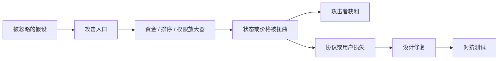

# 第 18 章 DeFi 攻击模式与经典案例

## 每一条规则背后都是一次真实的损失

本章不讲理论——讲的是真实发生过的事。每一起攻击事件的根因，都是某个设计假设在极端条件下被打破。

理解攻击模式的目的不是成为攻击者，而是**在写代码时就知道什么会出错**。

| 小节 | 攻击类型         | 核心教训                         |
| ---- | ---------------- | -------------------------------- |
| 18.1 | 预言机操纵       | 不要信任单一价格源               |
| 18.2 | 闪电贷攻击       | 闪电贷不是攻击，但降低了攻击成本 |
| 18.3 | 重入与逻辑漏洞   | Move 防了重入，但防不了逻辑错误  |
| 18.4 | 清算失效与级联   | 清算不是技术问题，是经济激励问题 |
| 18.5 | 治理攻击         | 管理员权限是最大的单点故障       |
| 18.6 | 十条安全设计原则 | 所有教训的总结                   |

## 攻击分析模板

读每个攻击案例时都按同一顺序拆解：攻击者需要什么前提，哪一个协议状态被改变，收益从哪里来，损失由谁承担，修复后应该新增哪类测试。这样才能把事故案例转化成工程动作。

## 本章目标

- 理解预言机操纵、闪电贷、逻辑漏洞、清算级联和治理攻击。
- 把攻击拆成前提、路径、获利点和协议损失。
- 理解 Move 消除部分经典漏洞但不能消除业务逻辑风险。
- 能从攻击案例反推设计原则。

## 先修知识

- 读过前面核心协议章节，理解价格、借贷、清算和权限。
- 能区分代码漏洞、机制漏洞和治理漏洞。

## 本章小结

攻击篇不是为了罗列事故，而是训练读者把协议当成对抗系统。每个漏洞都对应一个被忽略的信任边界、参数边界或资产流边界。

## 练习题

1. 把一个预言机操纵攻击拆成六个步骤。
2. 说明闪电贷本身为什么不是攻击。
3. 设计一个防权限遗漏的 Capability 检查表。
4. 从清算级联案例中提炼两个风控指标。

## 下一章连接

知道攻击路径后，下一章讨论如何把教学代码推进到可维护工程。
