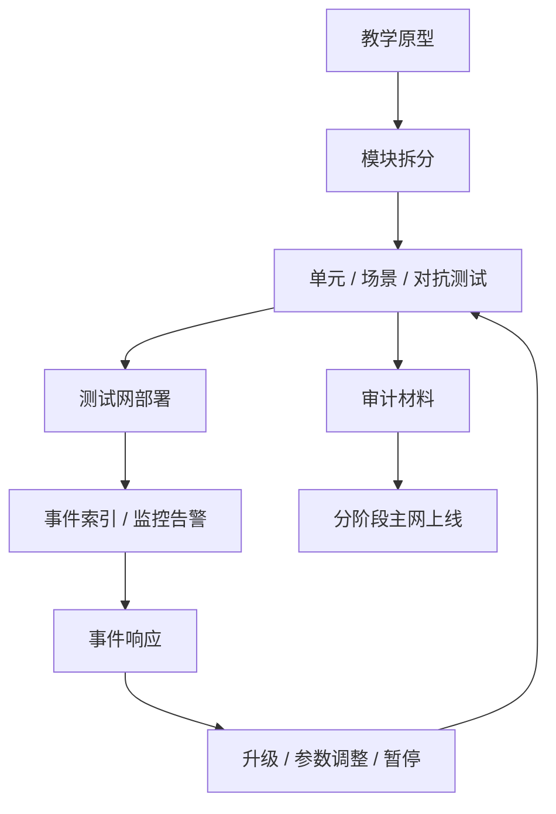

# 第 19 章 协议工程化实践

## 从"理解机制"到"交付工程"

前十八章教你理解 DeFi 的机制。本章教你如何把这些理解变成可维护、可部署、可审计的代码。

工程化不是"写完代码"。它是：

- 代码结构清晰，新人能看懂
- 测试覆盖充分，包括对抗场景
- 部署有流程，不是"点一下按钮"
- 出了问题有预案，不是"临时想"

## 工程交付闭环

工程化的判断标准不是“目录看起来像生产项目”，而是每一次修改都能被测试、部署、监控和回滚流程接住。没有这个闭环，代码越复杂，隐藏风险越多。

## 本章目标

- 把教学原型拆成模块边界清晰、权限明确、可测试的工程结构。
- 建立单元、场景、对抗测试的分层策略。
- 理解部署、升级、暂停和事件响应流程。
- 知道监控和告警需要覆盖哪些链上信号。

## 先修知识

- 理解至少一个完整协议的对象与资金流。
- 能运行 Move 测试并阅读事件输出。

## 本章小结

协议工程化的目标是让风险更早暴露、更容易复现、更容易处置。可维护代码、测试矩阵、部署流程和监控告警是同一个安全系统的不同部分。

## 练习题

1. 把一个单文件教学模块拆成 state、math、entry、events 四类职责。
2. 为借贷协议设计三层测试矩阵。
3. 列出一次合约升级前必须验证的五件事。
4. 设计一个清算异常的告警规则。

## 下一章连接

工程化之后，需要把材料交给外部审计和治理流程；下一章进入审计准备。
