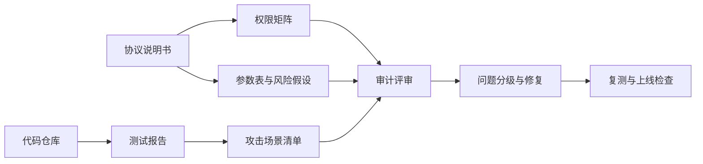

# 第 20 章 审计准备与风险治理

## 审计不是考试的补课

审计不是"写完代码后找人检查一下"。好的审计准备从写第一行代码时就开始了——文档、测试、参数表、权限矩阵，这些都是审计的基础材料。

## 审计交付物流水线

审计师最需要的不是口头解释，而是能交叉验证的材料：说明书解释设计意图，权限矩阵暴露高风险入口，测试报告证明正常和异常路径都被覆盖，参数表说明经济边界。缺少其中任何一项，审计都会退化成猜代码。

## 本章目标

- 理解审计前需要准备哪些文档、测试、部署和风险材料。
- 掌握权限矩阵、高风险函数和攻击树分析方法。
- 建立参数治理、去中心化路径和上线前检查清单。
- 能把协议交付物组织成审计师可高效验证的形式。

## 先修知识

- 理解第 19 章工程化实践和第 18 章攻击分类。
- 有基本代码阅读和风险文档编写能力。

## 本章小结

审计不是最后一步找人背书，而是从设计阶段开始积累可验证材料。好的审计准备能让问题更快暴露，也能避免团队把治理、权限和参数风险藏在代码之外。

## 练习题

1. 为一个 DEX 写三行权限矩阵。
2. 列出借贷协议中五个高风险函数。
3. 用攻击树描述一次管理员私钥泄露。
4. 设计一个上线前分阶段 TVL 上限。

## 下一章连接

审计准备关注交付流程；下一章回到 Move 和 DeFi 安全模式本身。
