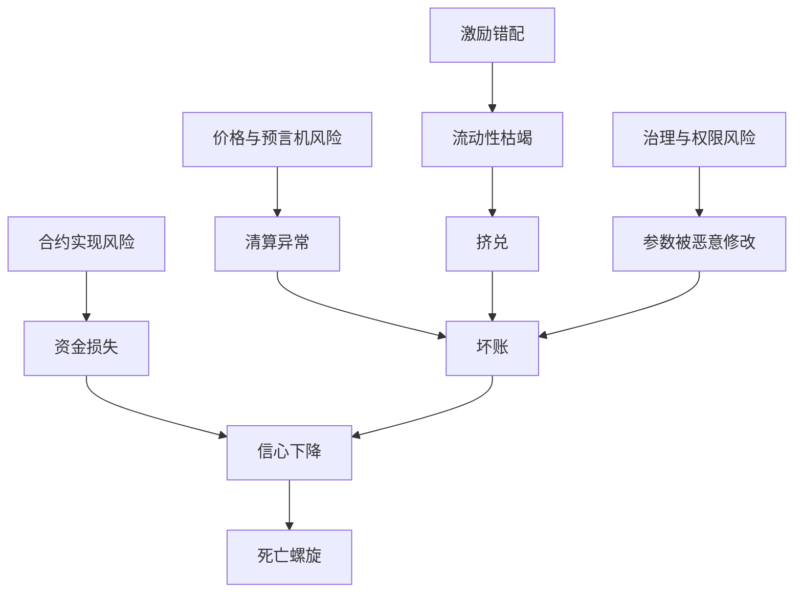

# 第 22 章 DeFi 风险控制全景

第 18–21 章从攻击、工程、审计与 Move 实践等角度覆盖安全；本章换一个视角——**从系统设计者的角度看风险管理**（与前几章**互补而非逐条重复**：攻击细节见第 18 章，审计清单见第 20 章，升级与多签操作见第 21 章）。

一个 DeFi 协议的长期存活，不只取决于代码没有漏洞，更取决于：

- 风险是否被**识别**和**量化**
- 经济激励是否**对齐**了参与者利益
- 极端情况下系统是否**有足够的缓冲**来吸收冲击

本章**不逐条复述**攻击代码细节（见第 18 章）或审计交付物模板（见第 20 章），而是建立一个**系统级风险控制框架**，帮助你从「代码安全」走向「协议安全」。

## 本章结构

本章分为八个部分，共 **19** 节（原 22.7「生命线」与 22.8「操纵模式」已合并为一节，避免价格主题重复）：

| 部分 | 主题                 | 小节          |
| ---- | -------------------- | ------------- |
| 一   | DeFi 风控基础        | 22.1 - 22.3   |
| 二   | 核心技术风险         | 22.4 - 22.6   |
| 三   | 价格与预言机风险     | 22.7 - 22.8   |
| 四   | 抵押与清算风险       | 22.9 - 22.11  |
| 五   | 流动性与挤兑风险     | 22.12 - 22.14 |
| 六   | 治理与权限风险       | 22.15 - 22.16 |
| 七   | 系统性风险           | 22.17         |
| 八   | 开发者必须理解的风险 | 22.18 - 22.19 |

每一节都包含：风险的本质描述、数学模型或量化方法、Sui/Move 生态中的实际案例、可操作的防御建议。

## 系统性风险传导图

本章的阅读方式是从单点风险追到系统结果。预言机错误可能表现为清算失败，清算失败会变成坏账，坏账会触发存款人撤离，撤离又会加剧流动性枯竭。风险控制的价值就在于提前切断这些传导路径。

## 本章目标

- 把前文攻击、工程、审计和 Move 安全整合成系统级风险控制框架。
- 理解合约、价格、清算、流动性、治理和激励风险之间的传导。
- 掌握储备金、保险基金、限额、熔断和分阶段上线的使用场景。
- 能为一个 DeFi 协议写出上线前风险控制计划。

## 先修知识

- 读过核心协议章节和第 18-21 章安全内容。
- 能用资产流、参数表和场景压力测试描述风险。

## 本章小结

DeFi 风控的核心是承认协议永远运行在不确定环境中。好的设计不是假设预言机、清算人、治理和流动性永远正常，而是为它们失效时的损失边界和恢复路径提前建模。

## 练习题

1. 为借贷协议列出五类风险来源和对应监控指标。
2. 说明保险基金能覆盖什么，不能覆盖什么。
3. 设计一个极端行情下的分阶段熔断策略。
4. 写一份主网上线前 7 天风险检查清单。

## 下一章连接

正文到此结束。附录提供术语、公式、工具链、阅读材料、代码索引和从合约到产品的交付闭环。
