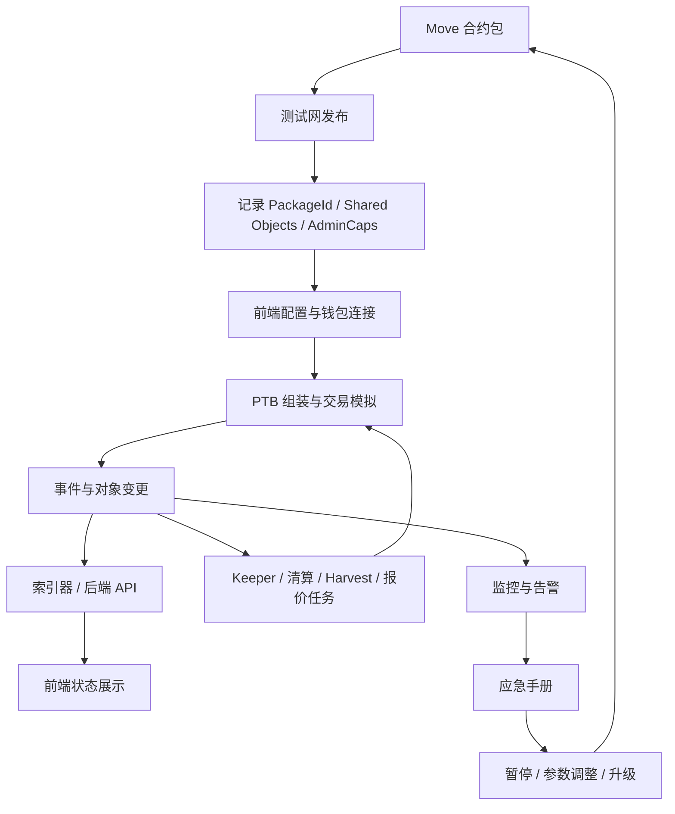

# 附录 F 从合约到产品的交付闭环

前面各章主要围绕机制和合约展开。真正上线一个 Sui DeFi 产品时，还需要把合约、前端、交易组装、索引、Keeper、监控和应急流程连成闭环。本附录给出一条最小但完整的交付路径。

## 总览



## 1. 合约发布材料

每个合约包发布后，至少记录这些信息：

| 项目 | 用途 |
| ---- | ---- |
| `PackageId` | 前端和脚本构造 `moveCall` 的目标 |
| 共享对象 ID | 例如池、市场、预言机配置、Vault |
| 管理能力对象 | `AdminCap`、`PauseCap`、`OracleCap` 等权限边界 |
| 初始化参数 | 费率、LTV、清算阈值、时间窗口、上限 |
| 升级策略 | 是否兼容升级、谁能升级、是否有时间锁 |

不要只把这些值写在部署者本机的 `.env` 里。至少需要一份可审计的部署记录，供前端、运维、审计和治理共同引用。

## 2. 前端连接钱包

前端的职责不是“调用合约函数”这么简单。一个可用的 DeFi 前端至少要处理：

- 网络选择：mainnet、testnet、devnet 的包地址和共享对象不同。
- 钱包连接：当前账户、余额、对象拥有权、签名能力。
- 交易预览：用户要付出什么、收到什么、最大滑点或最大债务是多少。
- 失败解释：把合约 abort、余额不足、对象版本冲突、预言机过期翻译成人能理解的错误。
- 交易后刷新：根据 digest、事件和对象变更更新页面。

前端不要硬编码“交易一定成功”。Sui 的对象版本、共享对象竞争、预言机更新和用户余额变化都会让交易在签名后失败。

## 3. PTB 组装层

PTB（Programmable Transaction Block）是 Sui DeFi 前端和脚本的核心交付层。建议把 PTB 构造从 UI 组件中拆出来，形成独立函数：

```typescript
type BuildSwapArgs = {
  packageId: string;
  poolId: string;
  coinInId: string;
  amountIn: bigint;
  minOut: bigint;
};
```

PTB 构造函数应该只负责三件事：

1. 选择对象和 coin。
2. 按协议顺序构造 `moveCall`。
3. 把用户约束写进参数，例如 `min_out`、`max_debt`、`deadline_ms`。

报价、风控、UI 文案和签名执行应放在调用层，不要塞进同一个函数。

## 4. 索引器与状态服务

链上对象是事实来源，但前端不能每次都靠遍历对象完成页面渲染。常见做法是：

| 数据 | 读取方式 |
| ---- | -------- |
| 用户余额和 owned object | 钱包账户 + Sui RPC |
| 协议全局状态 | 共享对象读取 |
| 历史交易和图表 | 事件索引 |
| 聚合报价和策略估算 | 后端 API 或 Keeper |
| 风险面板 | 索引器 + 参数表 + 预言机数据 |

事件设计会直接影响索引成本。合约里应为 deposit、withdraw、borrow、repay、liquidate、harvest、pause、upgrade 等关键操作发事件，并包含足够的对象 ID、用户地址和数值字段。

## 5. Keeper 与自动化任务

很多 DeFi 协议不是“用户点按钮”就能完整运行，还需要自动化任务：

| 任务 | 典型协议 |
| ---- | -------- |
| 清算扫描与执行 | 借贷、CDP、衍生品 |
| Harvest / Rebalance | Yield Vault、CLMM 策略 |
| 价格更新 | Pull 模式预言机、聚合器 |
| 订单维护 | 订单簿做市、网格交易 |
| 风险限额调整建议 | 借贷、稳定币、衍生品 |

Keeper 必须是可替换的。合约不应该假设只有一个中心化 Keeper 能调用核心函数；更好的方式是用参数、奖励和权限边界让多个执行者可以竞争或备用。

## 6. 监控与应急

上线后至少监控这些信号：

- TVL、可用流动性、提款队列和利用率。
- 价格更新时间、置信区间、偏差和 fallback 触发次数。
- 清算队列长度、清算失败次数、坏账估算。
- 管理员函数调用、参数变更、暂停和升级事件。
- 前端交易失败率、RPC 错误率、对象版本冲突。

每个告警都应该对应一条 runbook：谁处理、先看哪里、能不能暂停、是否需要公告、恢复条件是什么。

## 上线前最小清单

- [ ] 合约包 `sui move test` 通过，关键失败路径有测试。
- [ ] PackageId、共享对象、能力对象和初始化参数已记录。
- [ ] 前端 PTB 构造层与 UI 解耦，所有用户约束可见。
- [ ] 事件足够索引核心状态和资金流。
- [ ] Keeper 任务可重启、可替换、可观察。
- [ ] 监控告警有明确阈值和应急手册。
- [ ] 测试网演练包含正常路径、失败路径和暂停恢复。

本附录不是替代第 19–22 章，而是把它们压缩成一条交付路线：先能验证，再能运行，再能观察，最后才能谈上线。
